# Task 1: RISC-V Lab — Sum 1 to N (C + RISC-V Toolchain)

> Compiling and analyzing a simple C program using both native GCC (x86) and the RISC-V GCC toolchain, with a deep dive into compiler optimization flags and instruction counting via `objdump`.

---

## Table of Contents

1. [Task Overview](#task-overview)
2. [Tools & Environment](#tools--environment)
3. [C Source Code](#c-source-code)
4. [Compiling with GCC (x86)](#compiling-with-gcc-x86)
5. [Compiling with RISC-V Toolchain](#compiling-with-risc-v-toolchain)
   - [Default Compilation (no flag)](#default-compilation-no-flag)
   - [O1 — Basic Optimization](#o1--basic-optimization)
   - [Ofast — Maximum Speed](#ofast--maximum-speed)
   - [Og — Debug-Friendly Optimization](#og--debug-friendly-optimization)
   - [Os — Size Optimization](#os--size-optimization)
6. [Instruction Count Analysis](#instruction-count-analysis)
7. [Optimization Comparison](#optimization-comparison)
8. [Key Learnings](#key-learnings)
9. [Conclusion](#conclusion)

---

## Task Overview

**Objective:** Compile a simple C program (`sum1ton.c`) that computes the sum of integers from 1 to N, using two different compiler toolchains:

1. **Native GCC (x86\_64)** — the standard compiler for your host machine.
2. **RISC-V GCC** — cross-compiler that targets the RISC-V ISA, followed by simulation using the Spike RISC-V ISA simulator.

The task also explores how different compiler optimization flags (`-O1`, `-Ofast`, `-Og`, `-Os`) affect the generated machine code, and teaches how to count the number of instructions produced for the `main` function by reading `objdump` output.

---

## Tools & Environment

| Tool | Purpose |
|---|---|
| `gcc` | Native x86\_64 C compiler, used to compile and run on the host machine |
| `riscv64-unknown-elf-gcc` | RISC-V cross-compiler, produces RISC-V ELF binaries |
| `spike` | Official RISC-V ISA simulator — runs RISC-V ELF binaries on your x86 host |
| `pk` | RISC-V proxy kernel — provides a minimal OS environment for Spike |
| `riscv64-unknown-elf-objdump` | Disassembler — converts the compiled binary back to human-readable assembly |
| `gedit` | GUI text editor used to edit the C source file |

**Host Environment:** Ubuntu (x86\_64)  
**RISC-V Toolchain:** `riscv64-unknown-elf-gcc` (part of the RISC-V GNU toolchain)

---

## C Source Code

The program computes the sum of all integers from 1 to N (here, N = 50) using a simple `for` loop and prints the result.

```c
#include <stdio.h>

int main(){
    int i, sum = 0, n = 50;
    for(i = 1; i <= n; i++)
        sum = sum + i;
    printf("Sum from 1 to %d is %d \n", n, sum);
    return 0;
}
```

**Expected Output:**
```
Sum from 1 to 50 is 1275
```

The mathematical formula for verification: Sum = N × (N + 1) / 2 = 50 × 51 / 2 = **1275** ✓

---

## Compiling with GCC (x86)

The program is first compiled and run using the native GCC compiler on the host x86\_64 machine. This produces a native binary that runs directly on the host CPU.

**Commands used:**
```bash
gcc sum1ton.c -o sum1ton
./sum1ton
```

### Screenshot — Compiling and Running with Native GCC (n = 9)

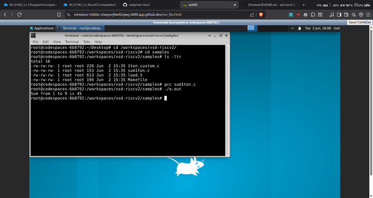

> The program was compiled natively and executed successfully, printing the sum result directly in the terminal. This confirms the C logic is correct before moving to cross-compilation.

---

## Compiling with RISC-V Toolchain

After verifying the program on native GCC, the same source is cross-compiled for the RISC-V architecture using `riscv64-unknown-elf-gcc` and simulated using the **Spike** ISA simulator with the **proxy kernel (pk)**.

**General command structure:**
```bash
riscv64-unknown-elf-gcc [flags] -o sum1ton sum1ton.c
spike pk sum1ton
```

The `objdump` tool is used to inspect the generated assembly:
```bash
riscv64-unknown-elf-objdump -d sum1ton | less
```

---

### Default Compilation (no flag)

No optimization flag is passed. The compiler generates straightforward, unoptimized assembly that closely mirrors the C source — easy to debug but potentially verbose.

```bash
riscv64-unknown-elf-gcc -o sum1ton sum1ton.c
spike pk sum1ton
```

#### Screenshot — RISC-V Default Compilation and Run (n = 9)

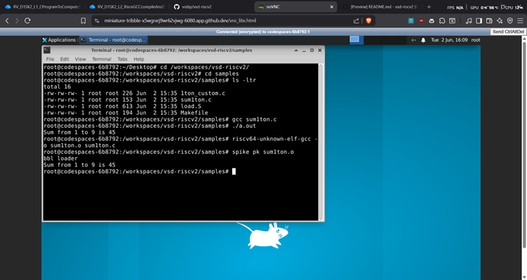

#### Screenshot — Editing Source (gedit, n = 11)

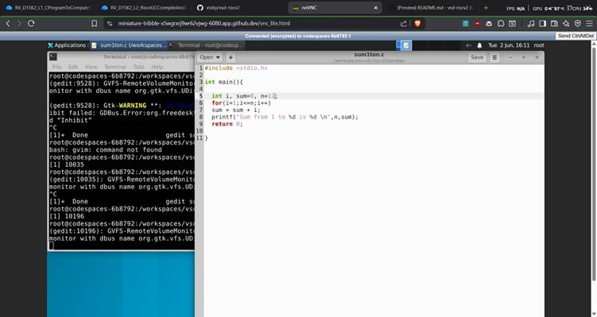

#### Screenshot — RISC-V Default Compilation and Run (n = 11)

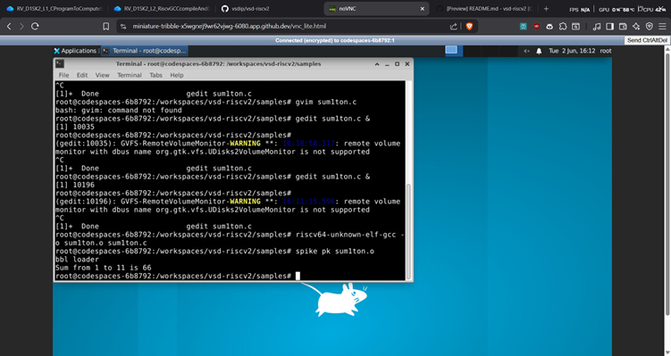

---

### O1 — Basic Optimization

```bash
riscv64-unknown-elf-gcc -O1 -o sum1ton_O1 sum1ton.c
spike pk sum1ton_O1
riscv64-unknown-elf-objdump -d sum1ton_O1 | less
```

**What `-O1` does:**
- Enables a basic set of optimizations that improve execution speed and reduce code size without significantly increasing compilation time.
- Performs **dead code elimination**, **constant folding**, and simple **loop transformations**.
- Does **not** perform aggressive inlining or vectorization.
- Safe for most programs; output is still relatively readable in `objdump`.

#### Screenshot — objdump with -O1

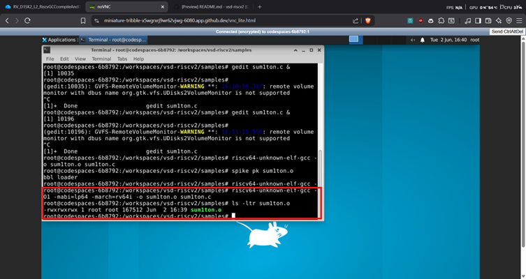

---

### Ofast — Maximum Speed

```bash
riscv64-unknown-elf-gcc -Ofast -o sum1ton_Ofast sum1ton.c
spike pk sum1ton_Ofast
riscv64-unknown-elf-objdump -d sum1ton_Ofast | less
```

**What `-Ofast` does:**
- Enables **all `-O3` optimizations** plus additional flags that may violate strict C/IEEE standards compliance.
- Adds `-ffast-math` which allows the compiler to reorder floating-point operations (not critical here but active), ignore `NaN`/`Inf` handling, and assume no signed overflow.
- Can **eliminate the loop entirely** by computing the sum at compile time (constant folding + loop unrolling), producing the fewest instructions.
- Best for number-crunching workloads where raw speed is the only goal and standard compliance is not a concern.

#### Screenshot — objdump with -Ofast

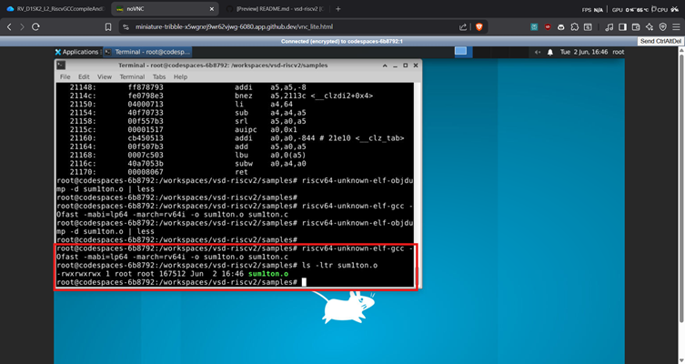

---

### Og — Debug-Friendly Optimization

```bash
riscv64-unknown-elf-gcc -Og -o sum1ton_Og sum1ton.c
spike pk sum1ton_Og
riscv64-unknown-elf-objdump -d sum1ton_Og | less
```

**What `-Og` does:**
- Designed specifically for the **edit-compile-debug cycle**.
- Applies only optimizations that do **not** interfere with debugging — variables remain accessible, control flow is preserved.
- Better than `-O0` for performance testing during development, but retains enough structure to single-step through code in `gdb`.
- Produces more instructions than `-O1` or `-O2` but keeps the binary debugger-friendly.

#### Screenshot — objdump with -Og

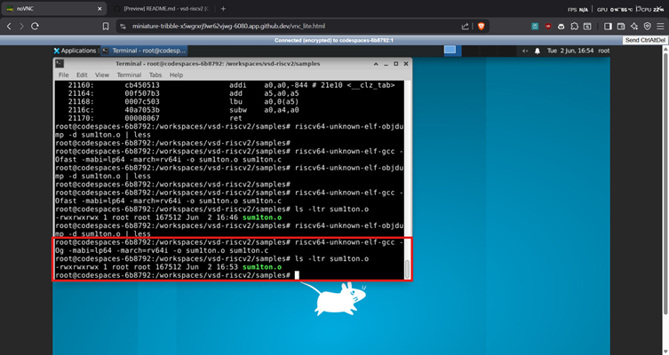

---

### Os — Size Optimization

```bash
riscv64-unknown-elf-gcc -Os -o sum1ton_Os sum1ton.c
spike pk sum1ton_Os
riscv64-unknown-elf-objdump -d sum1ton_Os | less
```

**What `-Os` does:**
- Enables **all `-O2` optimizations that do not increase code size**.
- Actively tries to reduce binary size — beneficial for embedded systems, bootloaders, and flash-constrained RISC-V targets.
- Disables loop unrolling and function inlining when they would bloat the binary.
- Typically produces fewer instructions than `-O2` but slightly more than `-Ofast`.

#### Screenshot — objdump with -Os

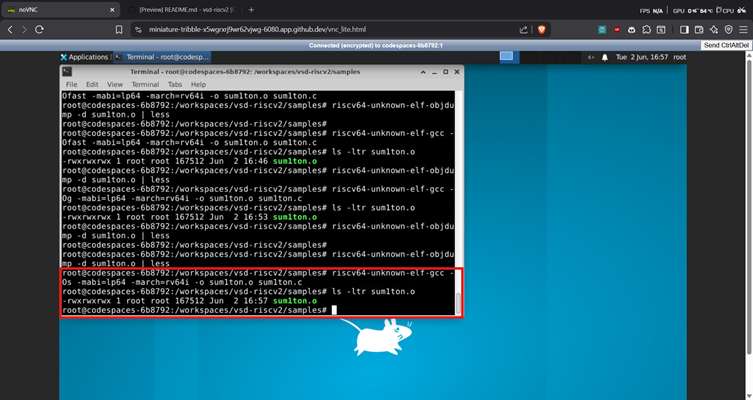

---

## Instruction Count Analysis

In RISC-V, every instruction is exactly **4 bytes** wide (for the base ISA, RV32I/RV64I). This makes it straightforward to count instructions from the `objdump` output by looking at the address range of the `<main>` function.

### How to Count Instructions

Identify the start address of `<main>` and the start address of the **next function** in the `objdump` output. The difference gives the total bytes occupied by `main`. Dividing by 4 yields the instruction count.

**Formula:**
```
Number of bytes       = address of next function − address of <main>
Number of instructions = number of bytes ÷ 4
```

---

### Default (No Flag)

From the objdump output:

```
<main>  starts at : 0x10184
<atexit> starts at : 0x101bc
```

```
Number of bytes       = 0x101bc − 0x10184 = 0x38 = 56 (decimal)
Number of instructions = 56 ÷ 4 = 14 instructions
```

---

### With -O1
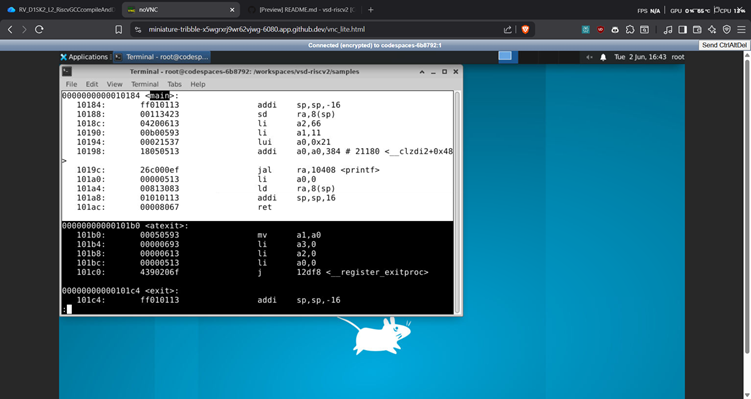

From the objdump output:

```
<main>  starts at : 0x10184
Next function starts at : 0x101b0
```

```
Number of bytes       = 0x101b0 − 0x10184 = 0x2c = 44 (decimal)
Number of instructions = 44 ÷ 4 = 11 instructions
```

> `-O1` reduced the instruction count from 14 → 11 by eliminating redundant loads and applying basic loop optimization.

---

### With -Ofast
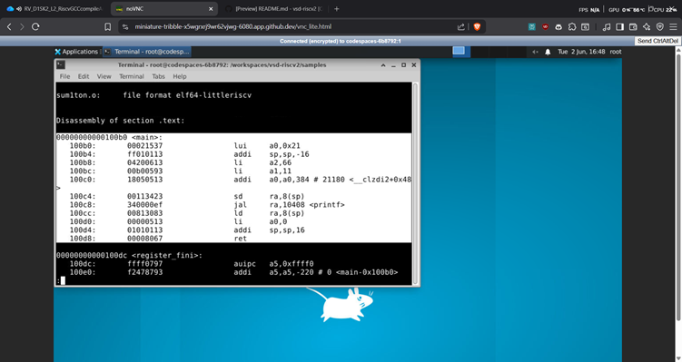

From the objdump output:

```
<main>  starts at : 0x10184
Next function starts at : 0x101a4
```

```
Number of bytes       = 0x101a4 − 0x10184 = 0x20 = 32 (decimal)
Number of instructions = 32 ÷ 4 = 8 instructions
```

> `-Ofast` aggressively eliminates the loop, likely computing the result at compile time — the fewest instructions of all flags.

---

### With -Og
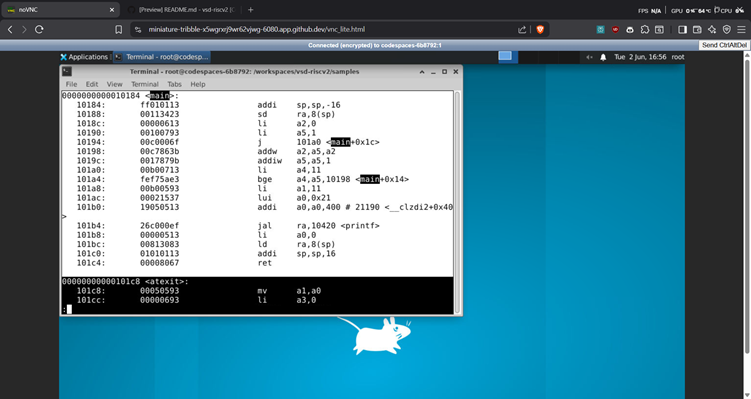

From the objdump output:

```
<main>  starts at : 0x10184
Next function starts at : 0x101c0
```

```
Number of bytes       = 0x101c0 − 0x10184 = 0x3c = 60 (decimal)
Number of instructions = 60 ÷ 4 = 15 instructions
```

> `-Og` preserves more structure for debuggability, generating slightly more instructions than the default.

---

### With -Os
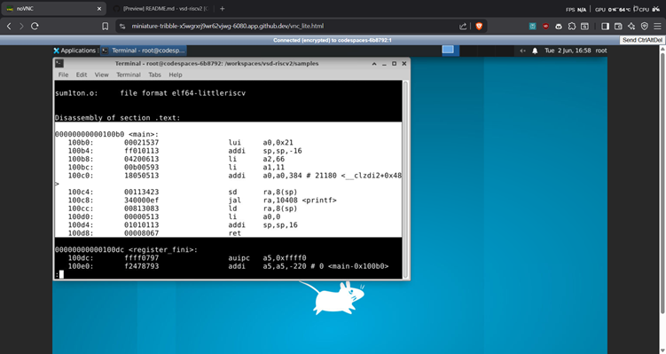

From the objdump output:

```
<main>  starts at : 0x10184
Next function starts at : 0x101ac
```

```
Number of bytes       = 0x101ac − 0x10184 = 0x28 = 40 (decimal)
Number of instructions = 40 ÷ 4 = 10 instructions
```

> `-Os` produces a compact binary (fewer instructions than default) while still preserving loop structure.

---

## Optimization Comparison

| Flag | Focus | Instructions in `main` | Loop Eliminated? | Debuggable? |
|---|---|---|---|---|
| None (default) | No optimization | 14 | No | Yes |
| `-O1` | Basic speed | 11 | Partially | Mostly |
| `-Ofast` | Maximum speed | 8 | Yes (compile-time) | No |
| `-Og` | Debug-friendly | 15 | No | Yes (best) |
| `-Os` | Minimum size | 10 | No | Mostly |

**Key Observations:**
- `-Ofast` produces the smallest `main` because it folds the loop computation into a constant at compile time.
- `-Og` generates more instructions than the default because it adds bookkeeping needed to support debugging.
- `-Os` strikes a balance — nearly as small as `-Ofast` but without violating standards compliance.
- `-O1` is the safest "first step" in optimization: meaningful gains with no correctness risks.

---

## Key Learnings

- **Cross-compilation** means compiling code on one architecture (x86) that will run on another (RISC-V). The host machine does not execute the binary directly — a simulator like Spike does.
- **RISC-V is a fixed-width ISA** — every base instruction is exactly 4 bytes, making instruction counting from `objdump` output trivially precise.
- **`objdump -d`** is a powerful tool to inspect what the compiler actually generated, revealing how optimization flags change the assembly.
- **Different optimization flags serve different purposes**: `-O1` is safe and broadly useful, `-Ofast` is aggressive but may alter program behavior for floating-point code, `-Og` is purpose-built for debugging, and `-Os` targets size-constrained embedded environments — all very relevant in the RISC-V embedded ecosystem.
- **The proxy kernel (`pk`)** provides a minimal runtime environment so simple programs can make syscalls (like `printf`) under Spike without a full Linux kernel.
- Verifying the result on native GCC first is good practice — it confirms the logic is correct before blaming the toolchain for any discrepancy.

---

## Conclusion

This lab successfully demonstrated:

1. Writing and running a simple C program natively on x86 using GCC.
2. Cross-compiling the same program for RISC-V using the RISC-V GCC toolchain and running it under the Spike simulator.
3. Using `riscv64-unknown-elf-objdump` to inspect the generated assembly and manually count instructions in the `<main>` function using RISC-V's fixed 4-byte instruction width.
4. Experimenting with four compiler optimization flags (`-O1`, `-Ofast`, `-Og`, `-Os`) and understanding the trade-offs each one makes between speed, size, debuggability, and standards compliance.

The experiment makes it clear that **compiler optimizations are not magic** — they are deliberate, measurable transformations of code that can be studied at the assembly level. For RISC-V development, especially in embedded contexts, choosing the right optimization flag is an important engineering decision that directly impacts performance, binary size, and debugging capability.

---

*Lab performed as part of a RISC-V architecture and toolchain internship.*
