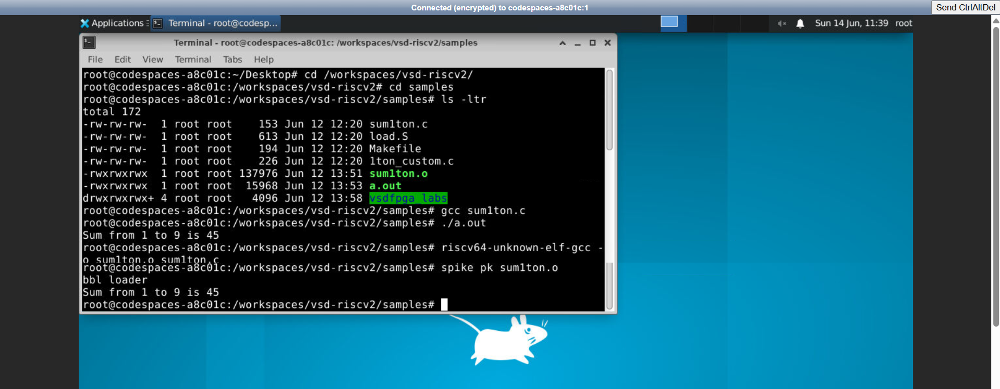
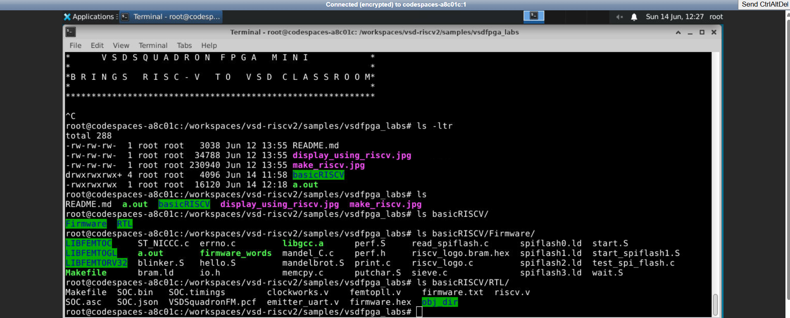
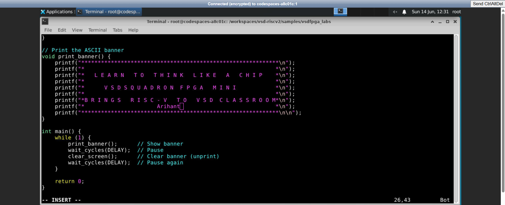
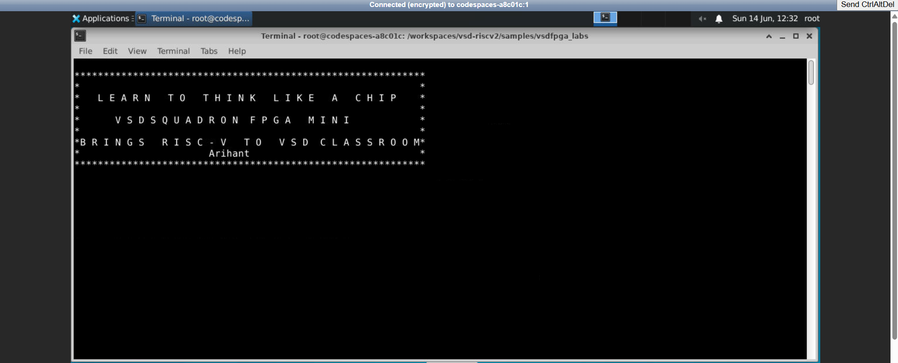

# Task 3: Environment Setup & RISC-V Reference Bring-Up

> Setting up the GitHub Codespace development environment, verifying the RISC-V toolchain with a reference program, running the VSDFPGA labs, and customizing the firmware banner — all as preparation for upcoming FPGA and IP development work.

---

## Table of Contents

1. [Task Overview](#task-overview)
2. [Objective](#objective)
3. [Tools & Environment](#tools--environment)
4. [Step 1 — GitHub Codespace Setup](#step-1--github-codespace-setup)
5. [Step 2 — Verifying the RISC-V Reference Flow](#step-2--verifying-the-risc-v-reference-flow)
   - [Compile and Run with GCC (x86)](#compile-and-run-with-gcc-x86)
   - [Compile and Run with RISC-V GCC + Spike](#compile-and-run-with-risc-v-gcc--spike)
6. [Step 3 — Clone and Run VSDFPGA Labs](#step-3--clone-and-run-vsdfpga-labs)
   - [Exploring the Lab Directory Structure](#exploring-the-lab-directory-structure)
   - [Running the VSDFPGA Reference Banner](#running-the-vsdfpga-reference-banner)
7. [Step 4 — Customizing the Firmware Banner](#step-4--customizing-the-firmware-banner)
   - [Editing the Program](#editing-the-program)
   - [Customized Output](#customized-output)
8. [Understanding Questions & Answers](#understanding-questions--answers)
9. [Key Learnings](#key-learnings)
10. [Conclusion](#conclusion)

---

## Task Overview

This task focuses on three foundational pillars of the VSD RISC-V workshop:

1. **Toolchain Readiness** — Confirming that both native GCC and the `riscv64-unknown-elf-gcc` cross-compiler are correctly installed and functional inside the GitHub Codespace.
2. **RISC-V Execution Flow** — Understanding how a C program travels from source code → cross-compilation → ELF binary → Spike simulation → terminal output.
3. **Environment Preparation** — Getting the `vsdfpga_labs` repository cloned, built, and running, so the workspace is ready for upcoming FPGA and IP development tasks.

---

## Objective

- Fork and launch the [vsd-riscv2](https://github.com/vsdip/vsd-riscv2) Codespace.
- Verify that `sum1ton.c` runs correctly on both the native GCC (x86) and the RISC-V Spike simulator.
- Clone `vsdfpga_labs`, explore its structure, and successfully run the reference RISC-V banner program.
- Customize the banner firmware with a personal identifier to confirm end-to-end edit → compile → run capability.
- Answer four conceptual questions about the RISC-V SoC architecture.

**Environment used:** GitHub Codespace — [Arihant-A/vsd-riscv2](https://github.com/Arihant-A/vsd-riscv2)

---

## Tools & Environment

| Tool | Purpose |
|---|---|
| GitHub Codespace | Cloud-hosted development environment with all toolchains pre-installed |
| `gcc` | Native x86\_64 C compiler — used for baseline verification |
| `riscv64-unknown-elf-gcc` | RISC-V cross-compiler — produces RISC-V ELF binaries |
| `spike` | Official RISC-V ISA simulator |
| `pk` | RISC-V proxy kernel — provides minimal OS / syscall support under Spike |
| `vim` | Terminal text editor used to modify the firmware C source |
| `vsdfpga_labs` | Repository containing the VSDSquadron FPGA Mini reference design |

---

## Step 1 — GitHub Codespace Setup

The official repository [vsdip/vsd-riscv2](https://github.com/vsdip/vsd-riscv2) was forked to a personal GitHub account and a Codespace was launched from the fork. The Codespace builds the full RISC-V toolchain environment automatically, providing `riscv64-unknown-elf-gcc`, `spike`, and `pk` without any manual installation.

**Steps followed:**
1. Forked `vsdip/vsd-riscv2` to [Arihant-A/vsd-riscv2](https://github.com/Arihant-A/vsd-riscv2).
2. Opened GitHub Codespace from the fork.
3. Confirmed the Codespace built successfully with no errors.

---

## Step 2 — Verifying the RISC-V Reference Flow

The reference program `sum1ton.c` is located at `vsd-riscv2/samples/sum1ton.c`. It computes the sum from 1 to N and was used to validate both compiler toolchains.

```c
#include <stdio.h>
int main(){
    int i, sum = 0, n = 9;
    for(i = 1; i <= n; i++)
        sum = sum + i;
    printf("Sum from 1 to %d is %d \n", n, sum);
    return 0;
}
```

**Expected output:** `Sum from 1 to 9 is 45`

Both the GCC (x86) and RISC-V Spike builds were verified in the same terminal session.

### Compile and Run with GCC (x86)

```bash
cd /workspaces/vsd-riscv2/samples
gcc sum1ton.c
./a.out
```

**Output:** `Sum from 1 to 9 is 45`

### Compile and Run with RISC-V GCC + Spike

```bash
riscv64-unknown-elf-gcc -o sum1ton.o sum1ton.c
spike pk sum1ton.o
```

**Output:**
```
bbl loader
Sum from 1 to 9 is 45
```

#### Screenshot — GCC and Spike Verification (Both in Same Terminal)



> Both the native GCC and RISC-V Spike runs produce identical output (`Sum from 1 to 9 is 45`), confirming the toolchain is correctly installed and the cross-compiled binary executes faithfully on the ISA simulator. The `bbl loader` line comes from the proxy kernel (`pk`) initializing before handing control to `main`.

---

## Step 3 — Clone and Run VSDFPGA Labs

With the RISC-V reference flow confirmed, the VSDFPGA labs repository was cloned into the same Codespace:

```bash
cd /workspaces/vsd-riscv2/samples
git clone https://github.com/vsdip/vsdfpga_labs.git
cd vsdfpga_labs
```

### Exploring the Lab Directory Structure

The `vsdfpga_labs` directory contains a complete RISC-V SoC reference design organized into two top-level components:

```
vsdfpga_labs/
└── basicRISCV/
    ├── Firmware/       ← C source code that runs on the RISC-V core
    └── RTL/            ← Verilog hardware description of the SoC
```

#### Screenshot — Directory Listing of vsdfpga_labs



**Key contents observed:**

**`basicRISCV/Firmware/`** contains the software side of the SoC:

| File | Purpose |
|---|---|
| `print.c` | Core `printf` implementation for UART output |
| `hello.S` | Assembly startup code |
| `start.S` | Entry point / reset vector |
| `riscv_logo.bram.hex` | Pre-compiled hex image loaded into block RAM |
| `riscv_logo.c` | C source for the RISC-V logo / banner program |
| `putchar.S` | Low-level character output over UART |
| `blinker.S` | LED blinker assembly demo |
| `sieve.c` | Sieve of Eratosthenes — math demo |
| `mandel_C.c` | Mandelbrot set renderer in C |
| `Makefile` | Build system for all firmware targets |
| `LIBFEMTOC`, `LIBFEMTOGL`, `LIBFEMTORV32` | Femto C library components |

**`basicRISCV/RTL/`** contains the hardware description:

| File | Purpose |
|---|---|
| `riscv.v` | Top-level RISC-V core Verilog |
| `femtopll.v` | PLL clock generation module |
| `emitter_uart.v` | UART transmitter — bridges RISC-V to serial output |
| `clockworks.v` | Clock divider and reset logic |
| `firmware.hex` / `firmware.txt` | Compiled firmware loaded into block RAM at synthesis |
| `SOC.bin`, `SOC.json` | Synthesized bitstream files |
| `VSDSquadronFM.pcf` | Physical constraints file — maps RTL signals to FPGA pins |
| `obj_dir/` | Verilator-generated simulation objects |

> The firmware file of interest, `riscv_logo.c`, is located at:  
> `/workspaces/vsd-riscv2/samples/vsdfpga_labs/basicRISCV/Firmware/riscv_logo.c`

---

### Running the VSDFPGA Reference Banner

The lab's reference program is a looping ASCII art banner that prints continuously to the terminal, simulating what the RISC-V core would output over UART on real hardware.

#### Screenshot — Original Banner Output


**Original output:**
```
*******************************************************
*                                                     *
*   LEARN TO THINK LIKE A CHIP                        *
*                                                     *
*        VSDSQUADRON FPGA MINI                        *
*                                                     *
*BRINGS RISC-V TO VSD CLASSROOM*
*                                                     *
*******************************************************
```

The program runs in an infinite `while(1)` loop — printing the banner, waiting (`wait_cycles(DELAY)`), clearing the screen, and repeating. This matches the behavior expected on real FPGA hardware where the RISC-V core continuously drives the UART.

---

## Step 4 — Customizing the Firmware Banner

To confirm complete end-to-end control of the firmware (edit → compile → run), the banner was modified in `vim` to add a personal identifier line.

### Editing the Program

The `print_banner()` function inside the firmware source was edited to add `* Arihant *` as a new line:

```bash
vim riscv_logo.c
```

#### Screenshot — Editing in vim



**The modified `print_banner()` function:**

```c
// Print the ASCII banner
void print_banner() {
    printf("*******************************************************\n");
    printf("*                                                     *\n");
    printf("*   LEARN TO THINK LIKE A CHIP                        *\n");
    printf("*                                                     *\n");
    printf("*        VSDSQUADRON FPGA MINI                        *\n");
    printf("*                                                     *\n");
    printf("*BRINGS RISC-V TO VSD CLASSROOM*\n");
    printf("*              Arihant                                *\n");   // ← added
    printf("*******************************************************\n\n");
}

int main() {
    while (1) {
        print_banner();       // Show banner
        wait_cycles(DELAY);   // Pause
        clear_screen();       // Clear banner (unprint)
        wait_cycles(DELAY);   // Pause again
    }
    return 0;
}
```

### Customized Output

After saving and recompiling, the updated banner appeared with the new line:

#### Screenshot — Modified Banner Output



**Updated output:**
```
*******************************************************
*                                                     *
*   LEARN TO THINK LIKE A CHIP                        *
*                                                     *
*        VSDSQUADRON FPGA MINI                        *
*                                                     *
*BRINGS RISC-V TO VSD CLASSROOM*
*              Arihant                                *
*******************************************************
```

The `* Arihant *` line now appears in the banner, confirming that the entire firmware build pipeline — from editing C source to running the binary — works correctly inside the Codespace.

---

## Understanding Questions & Answers

### 1. Where is the RISC-V program located in the vsd-riscv2 repository?

The toolchain validation program lives at `vsd-riscv2/samples/sum1ton.c`. This `samples/` directory is the starting point for all reference C programs — it is where the cross-compiler is first invoked and where the resulting ELF object (`sum1ton.o`) is written after compilation.

For the FPGA-level firmware, the primary source files are under `vsdfpga_labs/basicRISCV/Firmware/`. Notably, `riscv_logo.c` in that directory contains the looping banner program that runs on the soft RISC-V core on the FPGA, and `riscv_logo.bram.hex` is its pre-compiled memory image that gets loaded into block RAM during synthesis.

---

### 2. How is the program compiled and loaded into memory?

**Compilation** happens via the RISC-V cross-compiler:

```bash
riscv64-unknown-elf-gcc -o sum1ton.o sum1ton.c
```

This translates C source into a RISC-V ELF binary targeting the `rv64` instruction set — an executable that cannot run on the x86 host directly.

**Loading and execution** is handled by Spike together with the proxy kernel:

```bash
spike pk sum1ton.o
```

Spike parses the ELF binary, maps its sections (`.text`, `.data`, `.bss`) into a simulated memory space, and begins executing from the entry point. The proxy kernel (`pk`) acts as a lightweight runtime layer beneath the program: it configures the virtual memory map, intercepts system calls (such as the `write` syscall triggered by `printf`), and routes them to the host terminal. The program runs entirely in software with no physical chip involved.

---

### 3. How does the RISC-V core access memory and memory-mapped I/O?

In RISC-V, there is no separate category of "I/O instruction." Both RAM and peripheral devices share a unified address space, and the core reaches all of them using the same load/store instructions (`lw`/`sw`, `ld`/`sd`, etc.).

For ordinary RAM, the core places an address on the memory bus and the SRAM responds with data. For peripherals, the SoC designer maps each device's control registers to a fixed address range. A `sw` instruction targeting one of those addresses does not write to RAM — it triggers whatever the hardware at that address is wired to do. Writing to the UART's transmit register address, for example, causes the `emitter_uart.v` module to push that byte out over the serial line.

In the `basicRISCV` SoC:
- `femtopll.v` generates the system clock that everything runs on.
- `clockworks.v` divides that clock and handles reset sequencing.
- `emitter_uart.v` sits at a memory-mapped address; a `printf` call ultimately becomes a store to that address, and the UART module serializes the byte and sends it out through the physical FPGA pin declared in `VSDSquadronFM.pcf`.

---

### 4. Where would a new FPGA IP block logically integrate in this system?

Integrating a new IP block requires touching four layers of the design:

**RTL layer** — Write the new Verilog module and place it in `basicRISCV/RTL/`. Instantiate it inside the top-level wrapper `riscv.v`, connecting its data and enable lines to the address decoder alongside the existing peripherals.

**Address decoder** — Reserve a unique address range for the new IP in the address map. Any load or store from the RISC-V core targeting that range will be routed to the new module instead of RAM or another peripheral.

**Pin constraints** — If the IP has external signals (GPIO, SPI, I2C, PWM, etc.), add the corresponding pin assignments to `VSDSquadronFM.pcf` so the synthesizer knows which physical FPGA pins to connect them to.

**Firmware** — Control the IP from software by writing C code in `basicRISCV/Firmware/` that reads from or writes to the IP's assigned addresses using `volatile` pointer casts, ensuring the compiler does not optimize away the memory accesses.

---

## Key Learnings

- **GitHub Codespaces** provide a reproducible, zero-install development environment — the entire RISC-V toolchain (`riscv64-unknown-elf-gcc`, `spike`, `pk`) is available immediately after launch, eliminating dependency management friction.
- **The `bbl loader` message** seen at the start of every Spike run is the proxy kernel's startup message — it confirms that `pk` has initialized successfully and is about to hand control to the user program's `main`.
- **Cross-compilation vs. native compilation** produce functionally identical outputs (`Sum from 1 to 9 is 45`) but through fundamentally different paths: GCC compiles to x86 machine code that runs directly on the host CPU, while `riscv64-unknown-elf-gcc` compiles to RISC-V machine code that must be executed by a simulator or physical RISC-V chip.
- **The `vsdfpga_labs` directory structure** cleanly separates hardware (`RTL/`) from software (`Firmware/`), mirroring the architecture of real embedded SoC projects where the firmware engineer and RTL engineer work in parallel on the same system.
- **Memory-mapped I/O** is the bridge between software and hardware in RISC-V: there are no special port instructions — the same `lw`/`sw` instructions that access RAM also control peripherals when pointed at the right addresses.
- **Editing firmware and immediately seeing the output change** (the `* Arihant *` banner customization) is the fastest possible feedback loop for understanding how software controls hardware — a key skill before moving to actual FPGA synthesis.

---

## Conclusion

Task 3 successfully established the complete development environment for the VSD RISC-V workshop:

1. The GitHub Codespace at [Arihant-A/vsd-riscv2](https://github.com/Arihant-A/vsd-riscv2) was launched and verified to have all required toolchains pre-installed.

2. `sum1ton.c` was compiled and run on both the native x86 GCC and the RISC-V Spike simulator in the same terminal session — both producing `Sum from 1 to 9 is 45` — confirming the toolchain is fully functional.

3. The `vsdfpga_labs` repository was cloned and its structure explored, revealing a complete two-layer SoC design: `Firmware/` (software controlling the core) and `RTL/` (Verilog describing the hardware). The reference RISC-V banner program was run successfully.

4. The banner firmware was customized by adding `* Arihant *` to `print_banner()` in `riscv_logo.c`, recompiled, and the updated output confirmed — demonstrating full edit-compile-run capability inside the Codespace.

5. The four conceptual questions about program location, compilation/loading, memory-mapped I/O, and new IP integration were answered, providing the architectural foundation needed for the upcoming FPGA and custom IP development tasks.

The environment is now fully ready for Task 4 onward.

---

*Lab performed as part of the VSD RISC-V workshop using GitHub Codespace — [Arihant-A/vsd-riscv2](https://github.com/Arihant-A/vsd-riscv2)*
