# Task-4: Design & Integration of First Memory-Mapped IP GPIO


This document walks through designing a memory-mapped GPIO peripheral IP from scratch, wiring it into an existing single-cycle RISC-V SoC, and verifying it — including the mistakes made along the way and how each one was found and fixed. The SoC is built around a FemtoRV32-style core (`riscv.v`) with an existing LED and UART peripheral, running in the `vsdfpga_labs/basicRISCV` lab environment.


---

## Table of Contents

1. [Objective](#1-objective)
2. [Investigating the Existing SoC](#2-investigating-the-existing-soc)
3. [Designing the GPIO IP](#3-designing-the-gpio-ip)
4. [Integrating the IP into the SoC](#4-integrating-the-ip-into-the-soc)
5. [Making the Design Simulation-Safe](#5-making-the-design-simulation-safe)
6. [Standalone IP Verification](#6-standalone-ip-verification)
7. [Firmware — First Pass](#7-firmware--first-pass)
8. [Full-SoC Simulation: Faults and Debugging](#8-full-soc-simulation-faults-and-debugging)
9. [The Real Bug: Wrong Address Offset](#9-the-real-bug-wrong-address-offset)
10. [Final Result](#10-final-result)
11. [Hardware Build Flow](#11-hardware-build-flow)
12. [Known Issues / Future Work](#12-known-issues--future-work)
13. [Summary](#13-summary)

---

## 1. Objective

- Design a simple memory-mapped GPIO output/readback register as a standalone Verilog IP.
- Integrate it into an existing RISC-V SoC's memory bus without disturbing the existing LED/UART peripherals.
- Verify the IP in isolation with a dedicated testbench.
- Verify the IP end-to-end: firmware → CPU → bus → IP → bus → firmware.
- (Stretch goal) Synthesize and run static timing analysis for FPGA bring-up.

---

## 2. Investigating the Existing SoC

Before writing any RTL, the existing SoC had to be understood — specifically, *which* memory bus convention it used, since there's more than one common style (e.g. PicoRV32's `valid`/`ready` handshake vs. a simpler direct address/strobe bus).

**Build system overview** — `cat Makefile` to see how the existing RTL is synthesized, routed, and simulated:

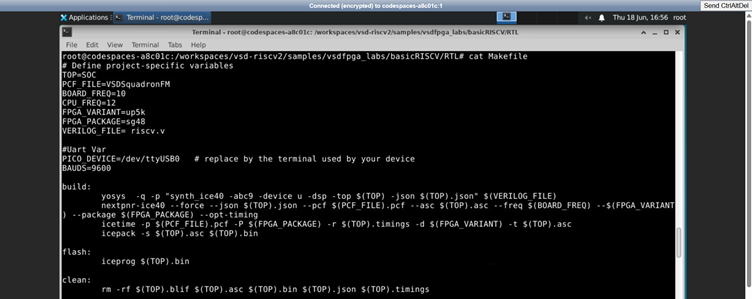
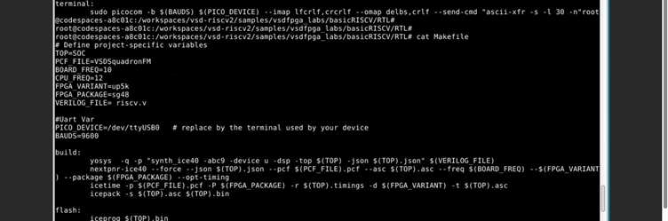


**Locating every Verilog module** in the project:


**Checking the bus protocol.** Searching for `mem_valid` / `mem_ready` — the PicoRV32 handshake signals — returned no matches. This is the key finding: the bus is **not** PicoRV32-style. It uses direct `mem_addr` / `mem_wstrb` / `mem_rstrb` signals with no valid/ready handshake.

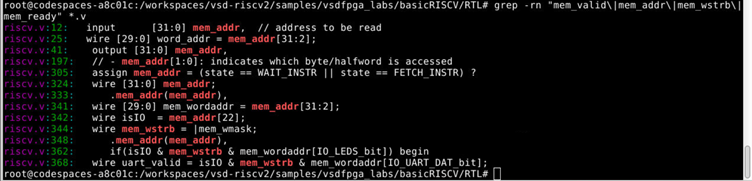

**Finding an existing peripheral to mimic** (the UART/LED interface):

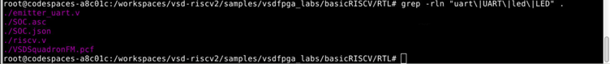

**Reading the actual bus port list** on the `Memory` module in `riscv.v`:

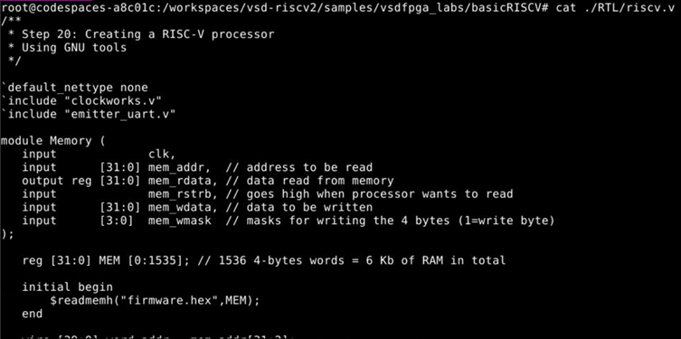

**Reading the existing UART peripheral** (`emitter_uart.v`) to see how a peripheral is normally written for this bus:

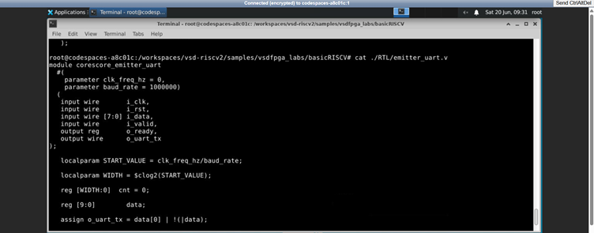

**Confirming `mem_rstrb` is a real, top-level signal** (not just used internally) — this matters because the GPIO IP needs a `mem_rstrb`-style read strobe input:

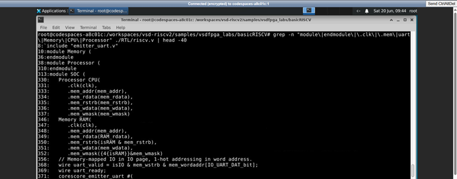

**Reading the IO decode convention** used by the existing peripherals — this is the most important discovery of the whole investigation phase:

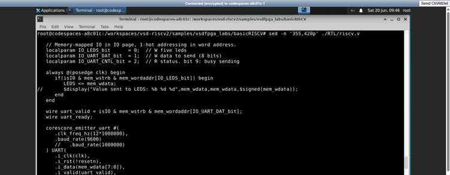

This confirms:
- IO space is selected by `wire isIO = mem_addr[22]`
- Inside IO space, peripherals are selected by **1-hot bits of the word address** (`mem_wordaddr[bit]`)
- Bits already in use: **bit 0 = LEDs, bit 1 = UART data, bit 2 = UART control** → **bit 3 is free** for the new GPIO IP.

---

## 3. Designing the GPIO IP

### First attempt — wrong bus convention (discarded)

The first version of `gpio_ip.v` was written assuming a **PicoRV32/PicoSoC-style** bus (`mem_valid`, `mem_ready`, 4-bit `mem_wstrb` write-strobe handshake):

```verilog
// VARIANT A — discarded: assumes a handshake bus this SoC doesn't have
module gpio_ip #(
    parameter BASE_ADDR = 32'h2000_0000
) (
    input  wire        clk,
    input  wire        resetn,
    input  wire        mem_valid,
    input  wire [31:0] mem_addr,
    input  wire [31:0] mem_wdata,
    input  wire [3:0]  mem_wstrb,
    output reg  [31:0] mem_rdata,
    output reg         mem_ready,
    output reg  [31:0] gpio_out
);
```

This directly contradicts the investigation in [Section 2](#2-investigating-the-existing-soc) — the grep for `mem_valid`/`mem_ready` had already shown those signals don't exist on this bus. This module was never instantiated or tested; it was rewritten before going any further.

### Final design — matches the actual bus

```verilog
// Simple Memory-Mapped GPIO Output IP
// Matches the bus style of riscv.v (direct addr/mask, no valid/ready)
// IO bit 3 selected (1-hot word address bit 3)

module gpio_ip (
    input  wire        clk,
    input  wire        resetn,
    input  wire        isIO,
    input  wire        mem_wstrb,
    input  wire        mem_rstrb,
    input  wire [29:0] mem_wordaddr,
    input  wire [31:0] mem_wdata,
    output reg  [31:0] gpio_rdata,
    output reg  [31:0] gpio_out
);

    localparam IO_GPIO_bit = 3; // 1-hot bit, unused by existing peripherals

    wire gpio_sel = isIO & mem_wordaddr[IO_GPIO_bit];

    always @(posedge clk) begin
        if (!resetn) begin
            gpio_out   <= 32'h0;
            gpio_rdata <= 32'h0;
        end else begin
            if (gpio_sel & mem_wstrb)
                gpio_out <= mem_wdata;
            if (gpio_sel & mem_rstrb)
                gpio_rdata <= gpio_out;
        end
    end

endmodule
```

**IP Specification**

| Port | Direction | Width | Purpose |
|---|---|---|---|
| `clk` | input | 1 | System clock |
| `resetn` | input | 1 | Active-low synchronous reset |
| `isIO` | input | 1 | High when CPU address is in IO space |
| `mem_wstrb` | input | 1 | Write strobe from CPU |
| `mem_rstrb` | input | 1 | Read strobe from CPU |
| `mem_wordaddr` | input | 30 | Word-aligned address bus |
| `mem_wdata` | input | 32 | Data to write |
| `gpio_rdata` | output | 32 | Data returned on read |
| `gpio_out` | output | 32 | Externally visible GPIO output register |

---

## 4. Integrating the IP into the SoC

**Step 1 — include the new file** in `riscv.v`:

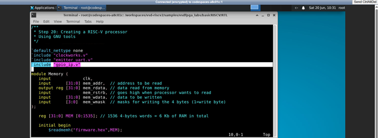

**Step 2 — instantiate it and extend the IO read mux** so a read from bit 3 returns `gpio_rdata`:

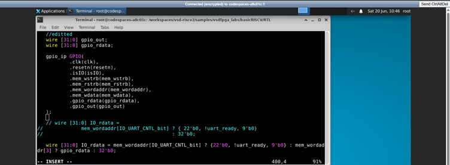

```verilog
wire [31:0] gpio_out;
wire [31:0] gpio_rdata;

gpio_ip GPIO(
    .clk(clk),
    .resetn(resetn),
    .isIO(isIO),
    .mem_wstrb(mem_wstrb),
    .mem_rstrb(mem_rstrb),
    .mem_wordaddr(mem_wordaddr),
    .mem_wdata(mem_wdata),
    .gpio_rdata(gpio_rdata),
    .gpio_out(gpio_out)
);

wire [31:0] IO_rdata =
        mem_wordaddr[IO_UART_CNTL_bit] ? { 22'b0, !uart_ready, 9'b0}
                                       : mem_wordaddr[3] ? gpio_rdata
                                       : 32'b0;
```

For contrast, here is what `IO_rdata` and the surrounding code looked like **before** this change (no GPIO branch, just UART control status or zero):

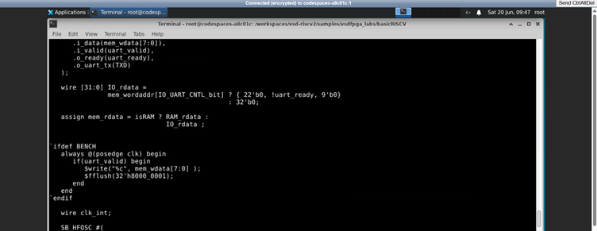

---

## 5. Making the Design Simulation-Safe

`riscv.v` and `clockworks.v` instantiate FPGA-hardware-only primitives (`SB_HFOSC`, the PLL in `femtopll.v`). These don't exist for the Icarus Verilog simulator, so they had to be excluded from `-DBENCH` builds.

**Guarding the oscillator/clockworks instantiation in `riscv.v`:**

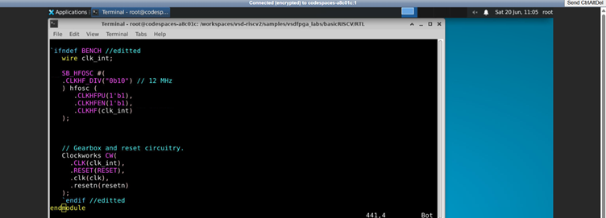

**Guarding the PLL include in `clockworks.v`:**

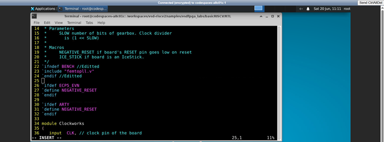

**Verifying the guarded design still compiles cleanly under `-DBENCH`:**

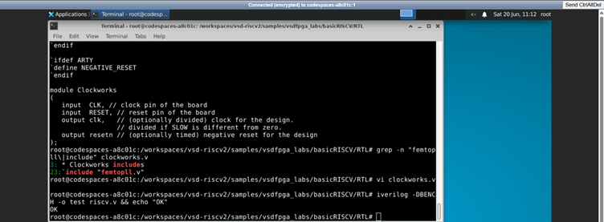

---

## 6. Standalone IP Verification

Before touching the full SoC, the GPIO IP was tested on its own with a dedicated testbench:

```verilog
`timescale 1ns/1ps
module gpio_tb;
    reg clk;
    reg resetn;
    reg isIO;
    reg mem_wstrb;
    reg mem_rstrb;
    reg [29:0] mem_wordaddr;
    reg [31:0] mem_wdata;
    wire [31:0] gpio_rdata;
    wire [31:0] gpio_out;

    gpio_ip DUT (
        .clk(clk), .resetn(resetn), .isIO(isIO),
        .mem_wstrb(mem_wstrb), .mem_rstrb(mem_rstrb),
        .mem_wordaddr(mem_wordaddr), .mem_wdata(mem_wdata),
        .gpio_rdata(gpio_rdata), .gpio_out(gpio_out)
    );

    always #5 clk = ~clk;

    initial begin
        $dumpfile("gpio_tb.vcd");
        $dumpvars(0, gpio_tb);

        clk = 0; resetn = 0;
        isIO = 0; mem_wstrb = 0; mem_rstrb = 0;
        mem_wordaddr = 0; mem_wdata = 0;

        #20 resetn = 1;

        // Write 0xDEADBEEF to GPIO
        #10;
        isIO = 1;
        mem_wordaddr = 30'b1000; // bit 3 set
        mem_wdata = 32'hDEADBEEF;
        mem_wstrb = 1;
        #10 mem_wstrb = 0;

        // Read back
        #10 mem_rstrb = 1;
        #10 mem_rstrb = 0;
        #10;

        $display("gpio_out  = 0x%h", gpio_out);
        $display("gpio_rdata = 0x%h", gpio_rdata);

        if (gpio_out == 32'hDEADBEEF)  $display("PASS: gpio_out correct");
        else                           $display("FAIL: gpio_out wrong");
        if (gpio_rdata == 32'hDEADBEEF) $display("PASS: readback correct");
        else                             $display("FAIL: readback wrong");

        $finish;
    end
endmodule
```

```
iverilog -o gpio_tb gpio_tb.v gpio_ip.v && vvp gpio_tb
```

**Result — both checks pass:**

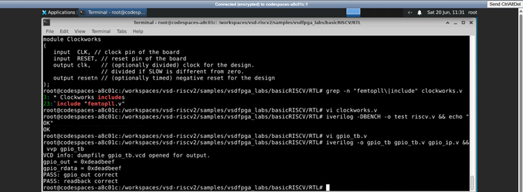

This confirms the IP itself is functionally correct in isolation, before any CPU/firmware is involved.

---

## 7. Firmware — First Pass

`io.h` at this point only defined the existing peripherals — no GPIO entry yet:

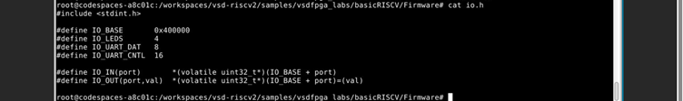

A first firmware test, `gpio_test.c`, was written using the **raw byte address `0xC`** directly, instead of adding a proper macro to `io.h`:

```c
#include "io.h"

void print_string(const char* s);
void print_hex(unsigned int val);

int main() {
    uint32_t val;

    print_string("Writing 0xDEADBEEF to GPIO\n");
    IO_OUT(0xC, 0xDEADBEEF);

    val = IO_IN(0xC);
    print_string("Readback: ");
    print_hex(val);
    print_string("\n");

    if (val == 0xDEADBEEF)
        print_string("PASS\n");
    else
        print_string("FAIL\n");

    return 0;
}
```

Build succeeded and the existing generic `%.hex: %.elf` Makefile rule automatically copied the result into `RTL/firmware.hex` — no custom Makefile target was needed:


---

## 8. Full-SoC Simulation: Faults and Debugging

### Fault 1 — No output at all

```
iverilog -DBENCH -o soc_sim riscv.v && vvp soc_sim
```

produced **nothing**:


**Cause:** in `-DBENCH` mode, `clk` and `resetn` were left as bare, undriven wires (since the real hardware oscillator was correctly excluded in [Section 5](#5-making-the-design-simulation-safe), but nothing was put in its place for simulation). With no clock edges, the CPU never executes a single instruction.

### Fix attempt 1 — introduced a new bug

A self-clocking block was added inside `` `ifdef BENCH ``, but with a naming mistake — `branch_clk` is declared, while `bench_clk` is the signal actually toggled and assigned:

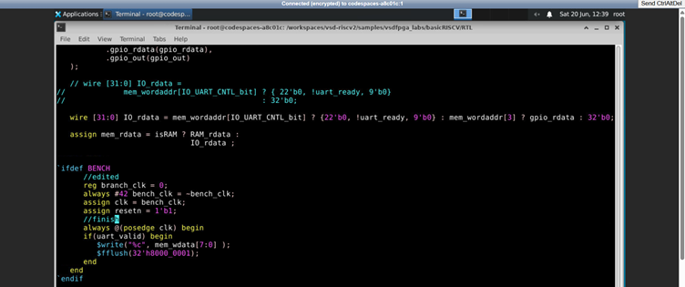

### Fix attempt 2 — corrected

```verilog
`ifdef BENCH
    reg clk = 0;
    reg resetn = 1;
    always #42 clk = ~clk;
    initial #800000000 $finish;
`else
    wire clk;
    wire resetn;
`endif
```

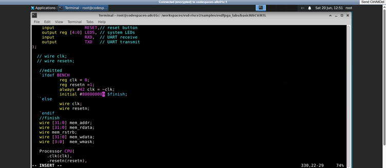

### Optimization — faster simulated UART

At 9600 baud, each printed character takes a long simulated time to fully transmit. The baud rate was temporarily raised to speed up turnaround while debugging:

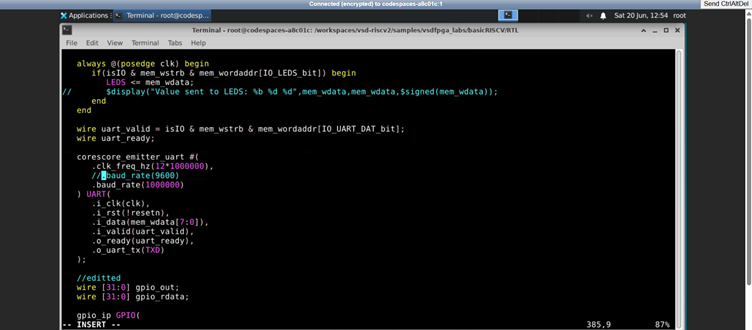

### Added debug instrumentation

`$display` taps were added directly on the bus so GPIO transactions are visible without waiting on UART timing:

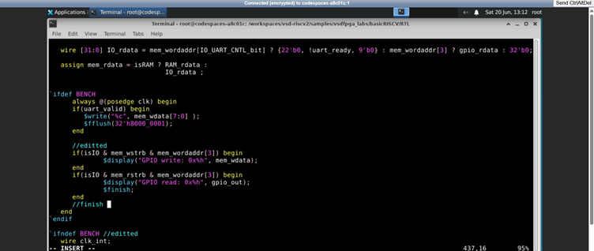

This version also included a `$finish` placed immediately after the GPIO-read `$display` — which would end the simulation the instant the bus-level read happens, before the firmware gets the chance to run its own `print_string`/`print_hex`/PASS-or-FAIL logic several cycles later. This was removed once noticed, so the firmware could run to completion.

### Known divergence — flagged, not yet resolved

At one point, `IO_rdata` ended up with **two different definitions** — one for `` `ifdef BENCH `` (drops the `!uart_ready` term) and one for synthesis (keeps it):

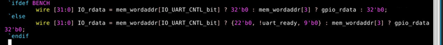

This likely works around `o_ready` in `emitter_uart.v` being an uninitialized register (reads as unknown/`X` for the first few cycles). It is tracked as an open item in [Section 12](#12-known-issues--future-work) rather than treated as resolved, since simulation and synthesis behavior should ideally match exactly.

---

## 9. The Real Bug: Wrong Address Offset

With the clocking and instrumentation fixed, the full simulation ran — and failed:

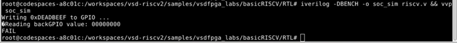

```
Writing 0xDEADBEEF to GPIO ...
Reading back GPIO value: 00000000
FAIL
```

**Root cause:** the GPIO IP selects itself with `mem_wordaddr[IO_GPIO_bit]` where `IO_GPIO_bit = 3`. That means the *word* address must equal exactly `8` (binary `1000`) — and word address = byte address ÷ 4. The byte offset used for GPIO was `0xC` (12), which is the **wrong** value for bit 3:

| Peripheral | Byte offset | ÷ 4 = word offset | Binary | Bit selected |
|---|---|---|---|---|
| `IO_LEDS` | 4 | 1 | `0001` | 0 ✓ |
| `IO_UART_DAT` | 8 | 2 | `0010` | 1 ✓ |
| `IO_UART_CNTL` | 16 | 4 | `0100` | 2 ✓ |
| GPIO — first try | **12** | **3** | **`0011`** | bits 0 & 1, **not** bit 3 ✗ |
| GPIO — correct | **32** | **8** | **`1000`** | bit 3 ✓ |

The rule is `byte_offset = 4 × 2^bit`. For bit 3 that's `4 × 8 = 32`, not 12.

### Fix

`io.h` — added the missing macro with the correct value:

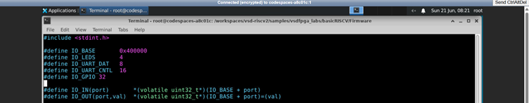

`gpio_test.c` — switched from the hardcoded `0xC` to the `IO_GPIO` macro:

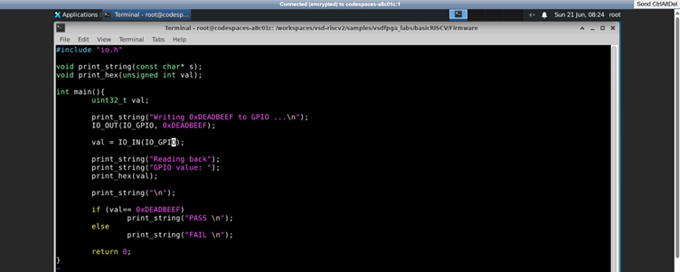

```c
#include "io.h"

void print_string(const char* s);
void print_hex(unsigned int val);

int main(){
    uint32_t val;

    print_string("Writing 0xDEADBEEF to GPIO ...\n");
    IO_OUT(IO_GPIO, 0xDEADBEEF);

    val = IO_IN(IO_GPIO);

    print_string("Reading back");
    print_string("GPIO value: ");
    print_hex(val);
    print_string("\n");

    if (val == 0xDEADBEEF)
        print_string("PASS \n");
    else
        print_string("FAIL \n");

    return 0;
}
```

Rebuilding the firmware after the fix:

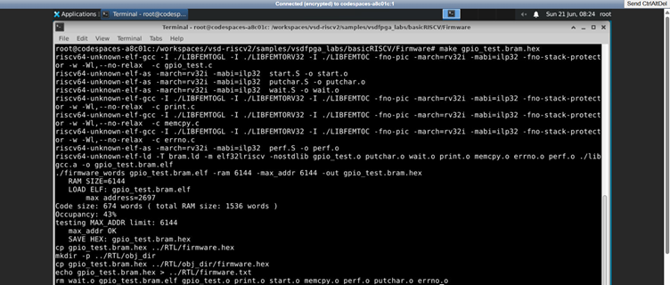

---

## 10. Final Result

Re-running the full SoC simulation end-to-end (firmware → CPU → bus → GPIO IP → bus → firmware):


```
Writing 0xDEADBEEF to GPIO ...
GPIO write: 0xdeadbeef
GPIO read: 0xdeadbeef
Reading back GPIO value: DEADBEEF
PASS
```

Write and readback match exactly, both at the raw bus level (`GPIO write` / `GPIO read` taps) and from the firmware's own perspective (`PASS`). The GPIO IP is verified working end-to-end inside the full SoC.

---

## 11. Hardware Build Flow

**Status:** Completed

The hardware build flow was successfully completed after resolving an environment compatibility issue with the pre-installed Yosys version. The default Makefile used the `-abc9` optimization flag, which was not supported by the available toolchain. To overcome this, the design was built manually using simplified Yosys commands while preserving the complete FPGA implementation flow.

Instead of the automated Makefile, the build was performed in three manual stages to ensure correct mapping to the **Lattice iCE40 UP5K** architecture.

### Step 1: RTL Synthesis (Yosys)

The RTL was synthesized into a JSON netlist targeting the iCE40 architecture.

```bash
yosys -q -p "synth_ice40 -top SOC -json SOC.json" riscv.v
```

<p align="center">
  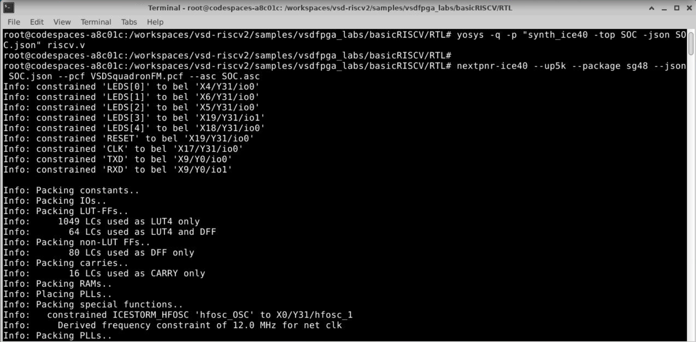
</p>

---

### Step 2: Place & Route (NextPNR)

The synthesized netlist was placed and routed while applying the FPGA pin constraints defined in `VSDSquadronFM.pcf`.

```bash
nextpnr-ice40 --up5k --package sg48 --json SOC.json --pcf VSDSquadronFM.pcf --asc SOC.asc
```

---

### Step 3: Bitstream Generation

The routed design was packed into a flashable FPGA bitstream using **icepack**. During this stage, Static Timing Analysis (STA) was also generated.

```bash
icepack SOC.asc SOC.bin
```

<p align="center">
  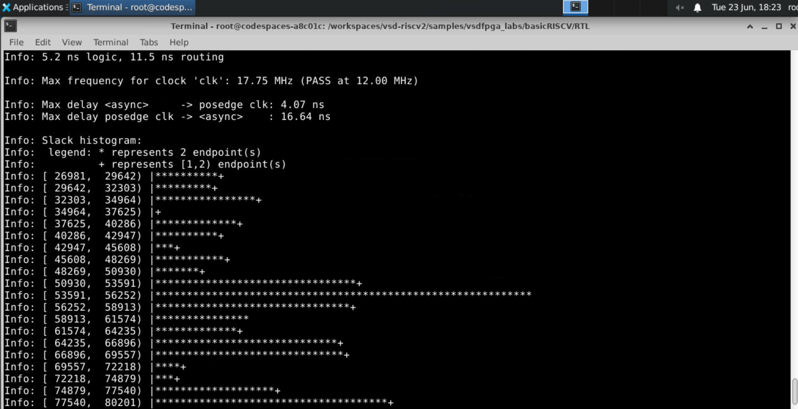
</p>

---

### Hardware Implementation Results

| Parameter | Result |
|-----------|--------|
| Target FPGA | Lattice iCE40 UP5K |
| Logic Utilization | ~1113 Logic Cells (LCs) |
| Maximum Frequency (Fmax) | **17.75 MHz** |
| Required Frequency | **12.00 MHz** |
| Timing Status | PASS |

The synthesized SoC, including the newly integrated GPIO peripheral, was successfully placed and routed on the target FPGA. Static Timing Analysis reported a maximum operating frequency of **17.75 MHz**, comfortably exceeding the required **12.00 MHz**, confirming successful timing closure.

---

## 12. Future Work

- Flash the generated **SOC.bin** bitstream onto the VSDSquadronFM FPGA board using **iceprog** (or an equivalent programming tool).
- Perform on-board validation of the GPIO peripheral.
- Remove a few leftover commented-out RTL lines from `riscv.v` to improve code readability.

---

## 13. Summary

During the GPIO peripheral integration, two RTL design issues and two simulation-environment issues were encountered and resolved through systematic debugging:

- Fixed an incorrect bus protocol implementation.
- Corrected an address offset mismatch.
- Added the missing clock driver in **BENCH** mode.
- Fixed a typo introduced while correcting the simulation environment.

After these corrections, the final design successfully:

-  Matches the SoC's existing **1-hot, word-addressed IO decode convention**.
-  Passes the standalone **gpio_tb.v** testbench.
-  Passes the complete firmware simulation by writing **0xDEADBEEF**, reading it back successfully, and reporting **PASS**.
-  Successfully synthesizes, places, routes, and achieves timing closure (**17.75 MHz**) on the target **iCE40 UP5K FPGA**.
