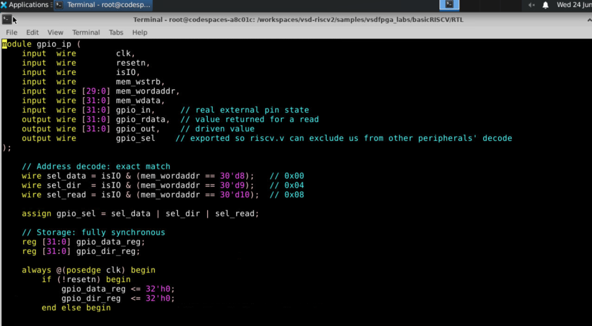
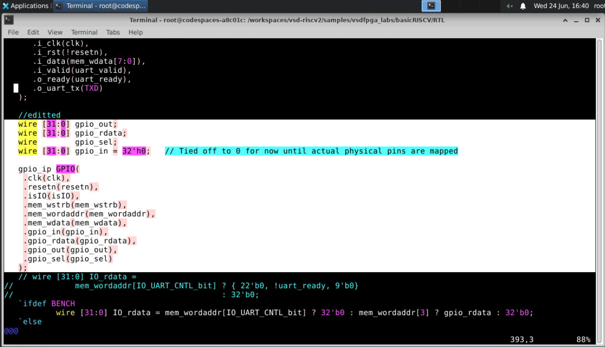
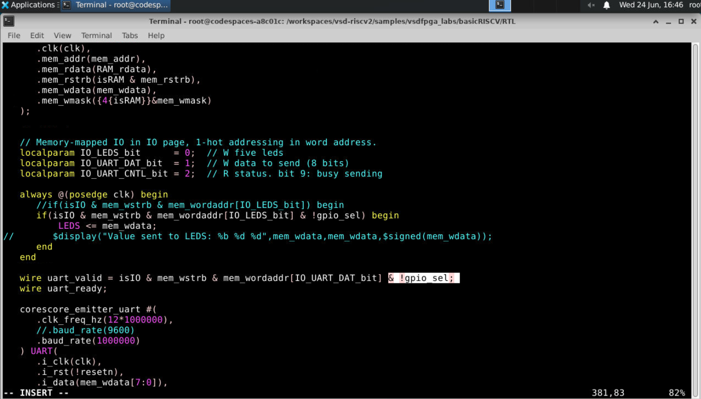
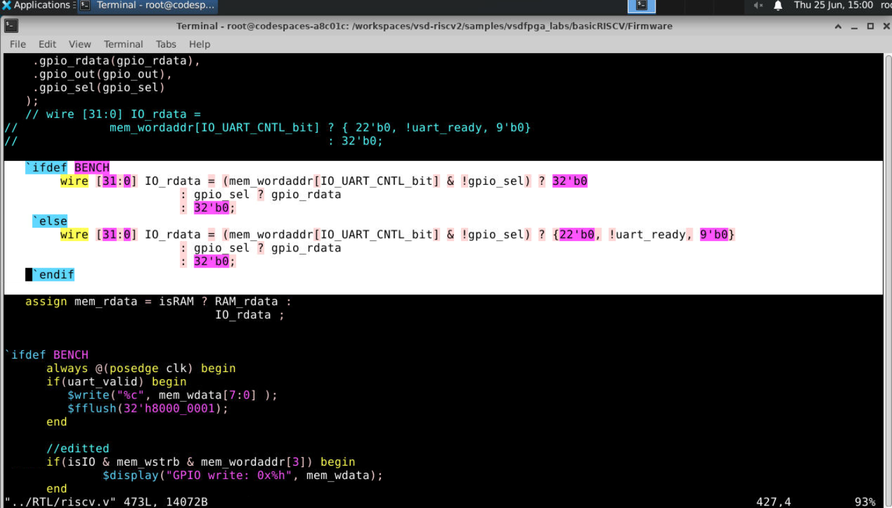
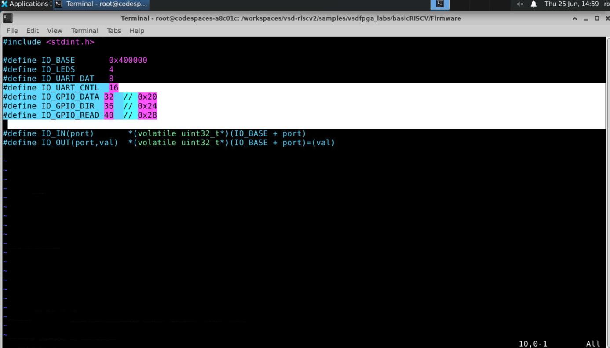
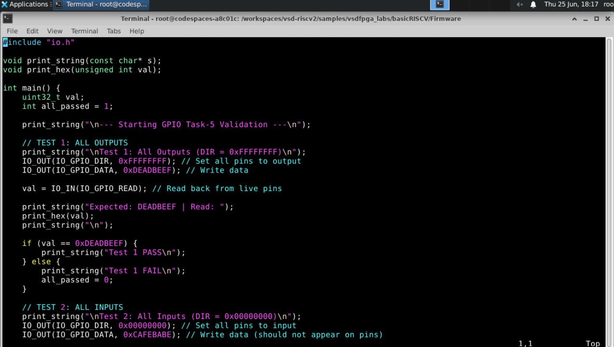
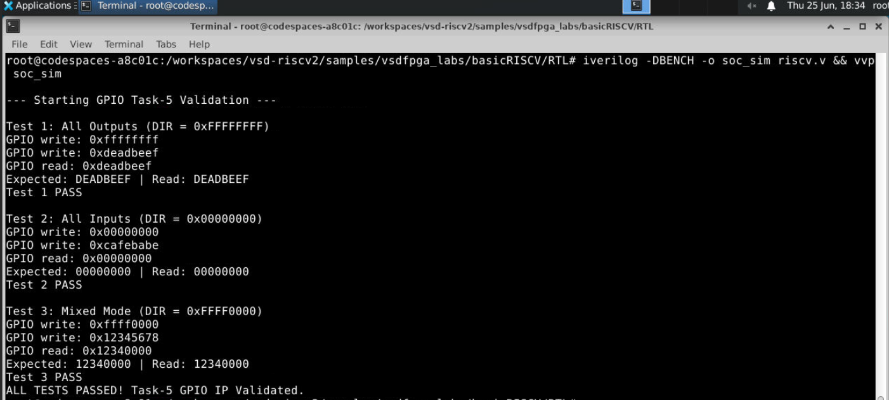
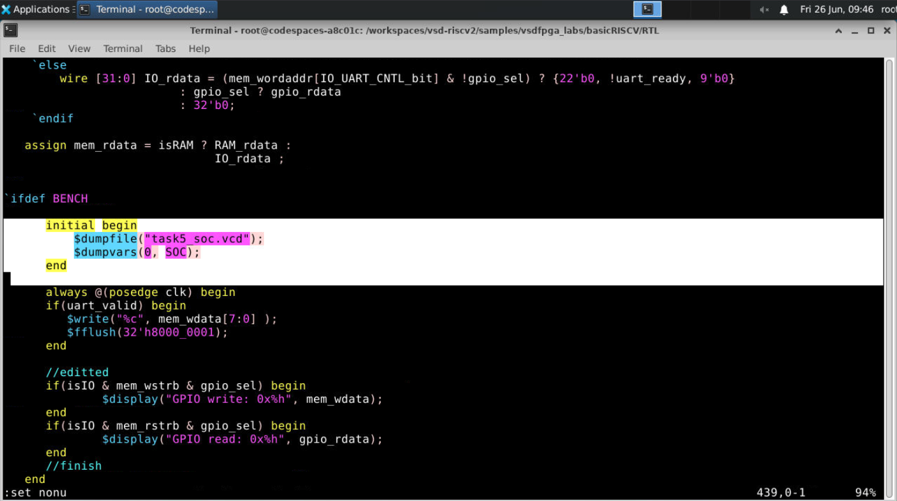

# Task-3 — GPIO IP with Data / Direction / Read Register Map

This task extends the Task-2 GPIO IP — a single self-decoding register with no real pin connection — into a proper 3-register, bidirectional GPIO peripheral with a real input-pin path, integrated cleanly alongside the existing LEDS/UART peripherals on the same SoC bus.

---

## Table of Contents

1. [Objective](#1-objective)
2. [Register Map](#2-register-map)
3. [Why a New Register Map Was Needed](#3-why-a-new-register-map-was-needed)
4. [Address Decoding — Design Decision](#4-address-decoding--design-decision)
5. [How Direction Affects Behavior](#5-how-direction-affects-behavior)
6. [Updated GPIO IP RTL](#6-updated-gpio-ip-rtl)
7. [SoC Integration](#7-soc-integration)
8. [Firmware](#8-firmware)
9. [Bug Found During Build, and the Fix](#9-bug-found-during-build-and-the-fix)
10. [Simulation Log](#10-simulation-log)
11. [Waveform Capture](#11-waveform-capture)
12. [End-to-End Trace](#12-end-to-end-trace-software--ip--signal)
13. [Files in This Submission](#13-files-in-this-submission)

---

## 1. Objective

- Replace the Task-2 single-register GPIO IP with a proper **3-register block**: `GPIO_DATA`, `GPIO_DIR`, `GPIO_READ`.
- Add a real `gpio_in` input path, so reads can reflect actual external pin state, not just a loopback of what was last written.
- Make direction (`GPIO_DIR`) per-bit configurable: 1 = output, 0 = input.
- Integrate without breaking the existing LEDS/UART peripherals on the same bus.
- Validate with firmware that exercises all-output, all-input, and mixed-mode behavior.

---

## 2. Register Map

| Register | Macro | Byte Offset | Word Address | Access | Description |
|---|---|---|---|---|---|
| `GPIO_DATA` | `IO_GPIO_DATA` | 32 (`0x20`) | 8 | R/W | Output data register. Write stores the value. Read returns **exactly what was last written**, regardless of direction. |
| `GPIO_DIR` | `IO_GPIO_DIR` | 36 (`0x24`) | 9 | R/W | Direction register, one bit per pin. `1` = output, `0` = input. |
| `GPIO_READ` | `IO_GPIO_READ` | 40 (`0x28`) | 10 | R only | Live pin readback. Per bit: if direction is output, returns the driven data bit; if input, returns the sampled external `gpio_in` bit. Writes are silently ignored — no write logic is implemented for this address. |

All three are reached through the same `IO_BASE` (`0x400000`) used by the existing LEDS/UART peripherals.

---

## 3. Why a New Register Map Was Needed

Task-2's `gpio_ip.v` was a single internal register with no register map at all:

- One register (`gpio_out`/`gpio_rdata`), selected by the SoC's existing 1-hot convention: `gpio_sel = isIO & mem_wordaddr[3]`.
- Write → loads `gpio_out`. Read → latches `gpio_out` into `gpio_rdata` one cycle later.
- No connection to any real external pin — it was a pure loopback: write a value, read the same value back.

That's structurally too small for this task, which needs **three** registers (data / direction / live-readback) behind one base address, plus a genuine external input path (`gpio_in`) that didn't exist before — Task-2's IP never had anywhere for "real pin state" to come from.

---

## 4. Address Decoding — Design Decision

The new registers sit at word addresses 8, 9, and 10 (`IO_GPIO_DATA/4`, etc.). Before deciding how to decode them, I checked these values against the SoC's **existing** decode convention and found a real collision risk:

| Register | Word addr | Binary (bits 5:0) | Collides with |
|---|---|---|---|
| `GPIO_DATA` | 8 | `001000` | none — bits 0, 1, 2 are all 0  |
| `GPIO_DIR` | 9 | `001001` | bit 1 set → also satisfies the *old* `IO_UART_DAT_bit` 1-hot check → would spuriously fire `uart_valid`, sending a stray UART byte every time `GPIO_DIR` is written  |
| `GPIO_READ` | 10 | `001010` | bit 2 set → also satisfies the *old* `IO_UART_CNTL_bit` check → corrupts the `IO_rdata` mux on every `GPIO_READ` read  |

This happens because the SoC's existing decode is **flat 1-hot** across the whole IO word-address space — each peripheral owns exactly one bit, with no concept of a peripheral occupying a *range* of words. A 3-word register block inevitably stomps on bits already claimed by LEDS/UART.

**Decision:** decode the GPIO IP itself with an **exact-match comparison** (`mem_wordaddr[7:0] == 8/9/10`) instead of a single-bit test, and export a `gpio_sel` signal from the IP so `riscv.v` can explicitly suppress LEDS/UART's own (still 1-hot) checks whenever the access actually belongs to GPIO. This keeps the collision fix in exactly one place (`gpio_sel`) instead of hard-coding exclusions all over `riscv.v`.

(The `[7:0]` rather than the full 30-bit address is a deliberate fix for a bug found during build — see [Section 9](#9-bug-found-during-build-and-the-fix).)

---

## 5. How Direction Affects Behavior

`GPIO_DIR` only changes what `GPIO_READ` returns — it has no effect on `GPIO_DATA`, which always reads back exactly what was written:

```verilog
wire [31:0] live_pins = (gpio_dir_reg & gpio_data_reg) | (~gpio_dir_reg & gpio_in);
```

Per bit `i`:
- `gpio_dir_reg[i] == 1` (output) → `live_pins[i] = gpio_data_reg[i]` — the pin reflects whatever was last written.
- `gpio_dir_reg[i] == 0` (input) → `live_pins[i] = gpio_in[i]` — the pin reflects the real external signal, ignoring whatever is sitting in the data register.

This mux is purely **combinational**, not registered — a live input pin's value shouldn't lag a cycle behind just because of how it's read out. `GPIO_DATA`'s own readback, by contrast, is a direct register read with no direction-dependent logic, matching the spec ("no direction-dependence here").

---

## 6. Updated GPIO IP RTL

Final, working version of `gpio_ip.v`:

```verilog
module gpio_ip (
    input  wire        clk,
    input  wire        resetn,
    input  wire        isIO,
    input  wire        mem_wstrb,
    input  wire [29:0] mem_wordaddr,
    input  wire [31:0] mem_wdata,
    input  wire [31:0] gpio_in,     // real external pin state
    output wire [31:0] gpio_rdata,  // value returned for a read
    output wire [31:0] gpio_out,    // driven value
    output wire        gpio_sel    // exported so riscv.v can exclude us from other peripherals' decode
);

    // --- Address decode: exact match, ignoring upper base bits ---
    wire sel_data = isIO & (mem_wordaddr[7:0] == 8'd8);   // 0x00 -> GPIO_DATA
    wire sel_dir  = isIO & (mem_wordaddr[7:0] == 8'd9);   // 0x04 -> GPIO_DIR
    wire sel_read = isIO & (mem_wordaddr[7:0] == 8'd10);  // 0x08 -> GPIO_READ

    assign gpio_sel = sel_data | sel_dir | sel_read;

    // Storage: fully synchronous
    reg [31:0] gpio_data_reg;
    reg [31:0] gpio_dir_reg;

    always @(posedge clk) begin
        if (!resetn) begin
            gpio_data_reg <= 32'h0;
            gpio_dir_reg  <= 32'h0;
        end else begin
            if (sel_data & mem_wstrb) gpio_data_reg <= mem_wdata;
            if (sel_dir  & mem_wstrb) gpio_dir_reg  <= mem_wdata;
            // sel_read: deliberately no write — GPIO_READ is read-only
        end
    end

    // Readback: combinational, complete
    wire [31:0] live_pins = (gpio_dir_reg & gpio_data_reg) | (~gpio_dir_reg & gpio_in);

    assign gpio_rdata = sel_data ? gpio_data_reg :
                        sel_dir  ? gpio_dir_reg  :
                        sel_read ? live_pins     :
                                   32'h0;

    assign gpio_out = gpio_data_reg;

endmodule
```

**Module signature** and the **first draft** of the address decode (before the `[7:0]` fix described in [Section 9](#9-bug-found-during-build-and-the-fix)):



---

## 7. SoC Integration

Four targeted edits to `riscv.v`, each isolated and easy to review independently.

### Update A — Instantiate the new IP

```verilog
wire [31:0] gpio_out;
wire [31:0] gpio_rdata;
wire        gpio_sel;
wire [31:0] gpio_in = 32'h0;   // tied off to 0 for now until actual physical pins are mapped

gpio_ip GPIO(
    .clk(clk),
    .resetn(resetn),
    .isIO(isIO),
    .mem_wstrb(mem_wstrb),
    .mem_wordaddr(mem_wordaddr),
    .mem_wdata(mem_wdata),
    .gpio_in(gpio_in),
    .gpio_rdata(gpio_rdata),
    .gpio_out(gpio_out),
    .gpio_sel(gpio_sel)
);
```



### Update B — Protect the LEDs

```verilog
// before
if(isIO & mem_wstrb & mem_wordaddr[IO_LEDS_bit]) LEDS <= mem_wdata;

// after
if(isIO & mem_wstrb & mem_wordaddr[IO_LEDS_bit] & !gpio_sel) LEDS <= mem_wdata;
```

### Update C — Protect the UART

```verilog
// before
wire uart_valid = isIO & mem_wstrb & mem_wordaddr[IO_UART_DAT_bit];

// after
wire uart_valid = isIO & mem_wstrb & mem_wordaddr[IO_UART_DAT_bit] & !gpio_sel;
```

Updates B and C together — both guards added in the same pass:



### Update D — Fix the read multiplexer

```verilog
// before (Task-2 mux — checked a fixed bit directly)
wire [31:0] IO_rdata =
        mem_wordaddr[3] ? gpio_rdata
        : mem_wordaddr[IO_UART_CNTL_bit] ? {22'b0, !uart_ready,9'b0} : 32'b0;

// after — driven by gpio_sel instead of a hard-coded bit, UART read also guarded
wire [31:0] IO_rdata =
        (mem_wordaddr[IO_UART_CNTL_bit] & !gpio_sel) ? {22'b0, !uart_ready, 9'b0}
        : gpio_sel ? gpio_rdata
        : 32'b0;
```



---

## 8. Firmware

`io.h` — the old single `IO_GPIO` macro is replaced with the three-register map:

```c
// before
#define IO_GPIO 32 // from Task-2

// after
#define IO_GPIO_DATA 32  // 0x20
#define IO_GPIO_DIR  36  // 0x24
#define IO_GPIO_READ 40  // 0x28
```



`gpio_test.c` — validation firmware exercising all three behaviors (all-output, all-input, mixed):

```c
#include "io.h"

void print_string(const char* s);
void print_hex(unsigned int val);

int main() {
    uint32_t val;
    int all_passed = 1;

    print_string("\n--- Starting GPIO Task-5 Validation ---\n");

    // TEST 1: ALL OUTPUTS
    print_string("\nTest 1: All Outputs (DIR = 0xFFFFFFFF)\n");
    IO_OUT(IO_GPIO_DIR, 0xFFFFFFFF);  // Set all pins to output
    IO_OUT(IO_GPIO_DATA, 0xDEADBEEF); // Write data

    val = IO_IN(IO_GPIO_READ);        // Read back from live pins

    print_string("Expected: DEADBEEF | Read: ");
    print_hex(val);
    print_string("\n");
    if (val == 0xDEADBEEF) {
        print_string("Test 1 PASS\n");
    } else {
        print_string("Test 1 FAIL\n");
        all_passed = 0;
    }

    // TEST 2: ALL INPUTS
    print_string("\nTest 2: All Inputs (DIR = 0x00000000)\n");
    IO_OUT(IO_GPIO_DIR, 0x00000000);   // Set all pins to input
    IO_OUT(IO_GPIO_DATA, 0xCAFEBABE);  // Write data (should not appear on pins)

    val = IO_IN(IO_GPIO_READ);         // Read back from live pins

    print_string("Expected: 00000000 | Read: ");
    print_hex(val);
    print_string("\n");
    if (val == 0x00000000) {
        print_string("Test 2 PASS\n");
    } else {
        print_string("Test 2 FAIL\n");
        all_passed = 0;
    }

    // TEST 3: MIXED MODE (Half Output, Half Input)
    print_string("\nTest 3: Mixed Mode (DIR = 0xFFFF0000)\n");
    IO_OUT(IO_GPIO_DIR, 0xFFFF0000);   // Top 16 bits = Output, Bottom 16 = Input
    IO_OUT(IO_GPIO_DATA, 0x12345678);  // Write data

    val = IO_IN(IO_GPIO_READ);         // Read back

    // Expected: Top 16 output shows '1234'. Bottom 16 input shows '0000'
    // (gpio_in is tied to 0 — see Update A)
    print_string("Expected: 12340000 | Read: ");
    print_hex(val);
    print_string("\n");
    if (val == 0x12340000) {
        print_string("Test 3 PASS\n");
    } else {
        print_string("Test 3 FAIL\n");
        all_passed = 0;
    }

    // FINAL RESULT
    if (all_passed) {
        print_string("ALL TESTS PASSED! Task-5 GPIO IP Validated.\n");
    } else {
        print_string("SOME TESTS FAILED! Check RTL.\n");
    }
    return 0;
}
```



---

## 9. Bug Found During Build, and the Fix

First build attempt (`make gpio_test.bram.hex` + simulation) came back with errors / failing tests. The cause was in the GPIO IP's own address decode, not the firmware:

```verilog
// before — compares the FULL word address against a literal 8/9/10
wire sel_data = isIO & (mem_wordaddr == 30'd8);   // 0x00
wire sel_dir  = isIO & (mem_wordaddr == 30'd9);   // 0x04
wire sel_read = isIO & (mem_wordaddr == 30'd10);  // 0x08
```

`mem_wordaddr` is the **full** 30-bit word address, which still carries the upper bits contributed by `IO_BASE` — it is never literally equal to the small integers `8`, `9`, or `10` on its own. `isIO` already confirms the access is in IO space; comparing the full address on top of that meant the comparison could never be true, so `gpio_sel` stayed permanently low and nothing ever reached the GPIO registers.

**Fix:** compare only the low byte of the word address, ignoring the upper base bits:

```verilog
// after — exact match, ignoring upper base bits
wire sel_data = isIO & (mem_wordaddr[7:0] == 8'd8);   // 0x00
wire sel_dir  = isIO & (mem_wordaddr[7:0] == 8'd9);   // 0x04
wire sel_read = isIO & (mem_wordaddr[7:0] == 8'd10);  // 0x08
```

![Fixed address decode using mem_wordaddr[7:0]](7.png)

Result: all tests passed after this change (see [Section 10](#10-simulation-log)).

---

## 10. Simulation Log

```
--- Starting GPIO Task-5 Validation ---

Test 1: All Outputs (DIR = 0xFFFFFFFF)
GPIO write: 0xffffffff
GPIO write: 0xdeadbeef
GPIO read: 0xdeadbeef
Expected: DEADBEEF | Read: DEADBEEF
Test 1 PASS

Test 2: All Inputs (DIR = 0x00000000)
GPIO write: 0x00000000
GPIO write: 0xcafebabe
GPIO read: 0x00000000
Expected: 00000000 | Read: 00000000
Test 2 PASS

Test 3: Mixed Mode (DIR = 0xFFFF0000)
GPIO write: 0xffff0000
GPIO write: 0x12345678
GPIO read: 0x12340000
Expected: 12340000 | Read: 12340000
Test 3 PASS

ALL TESTS PASSED! Task-5 GPIO IP Validated.
```



Reading the log against the register map confirms the direction logic works exactly as designed:
- **Test 1** (all-output): write `0xDEADBEEF`, every bit reads back unchanged — direction has no effect when all bits are outputs.
- **Test 2** (all-input): write `0xCAFEBABE` to `GPIO_DATA`, but `GPIO_READ` returns `0x00000000` — the write never reaches the pins because every bit is configured as input, and `gpio_in` is currently tied to 0.
- **Test 3** (mixed): write `0x12345678` with the top 16 bits set to output and bottom 16 to input — the readback is `0x12340000`: the top half passes through from `GPIO_DATA` (`1234`), the bottom half reflects the tied-off input (`0000`), confirming the per-bit mux in [Section 5](#5-how-direction-affects-behavior) works at the granularity it claims to.

---

## 11. Waveform Capture

VCD dumping was added inside the `` `ifdef BENCH `` block, and the GPIO write/read debug taps were switched to key off the IP's own exported `gpio_sel` rather than a hard-coded bit — consistent with the address-decode change in [Section 4](#4-address-decoding--design-decision):

```verilog
`ifdef BENCH
    initial begin
        $dumpfile("task5_soc.vcd");
        $dumpvars(0, SOC);
    end

    always @(posedge clk) begin
        if(uart_valid) begin
            $write("%c", mem_wdata[7:0]);
            $fflush(32'h8000_0001);
        end

        if(isIO & mem_wstrb & gpio_sel) begin
            $display("GPIO write: 0x%h", mem_wdata);
        end
        if(isIO & mem_rstrb & gpio_sel) begin
            $display("GPIO read: 0x%h", gpio_rdata);
        end
    end
`endif
```



`task5_soc.vcd` can be opened in GTKWave (`gtkwave task5_soc.vcd`) to inspect `gpio_data_reg`, `gpio_dir_reg`, `gpio_sel`, and `live_pins` cycle-by-cycle. The simulation log in [Section 10](#10-simulation-log) already gives complete pass/fail evidence on its own; the waveform is for deeper signal-level inspection if needed.

---

## 12. End-to-End Trace (Software → IP → Signal)

Walking through Test 1 (`IO_OUT(IO_GPIO_DIR, 0xFFFFFFFF)`) end-to-end:

1. **C macro** — `IO_OUT(IO_GPIO_DIR, val)` expands to a store instruction at byte address `IO_BASE + 36`.
2. **CPU bus** — the store drives `mem_addr = IO_BASE + 36`, asserts `mem_wstrb`, puts `val` on `mem_wdata`.
3. **SoC top-level decode** — `isIO = mem_addr[22]` goes high (address is in the IO page); `mem_wordaddr = mem_addr[31:2]` is computed.
4. **GPIO IP's own decode** — `sel_dir = isIO & (mem_wordaddr[7:0] == 9)` goes high; `gpio_sel` (the OR of all three `sel_*`) also goes high.
5. **Other peripherals suppressed** — because `gpio_sel` is high, the LEDS write guard and `uart_valid` (Updates B/C) both stay low even if their own bit pattern happens to overlap, so nothing spurious happens on LEDS or UART.
6. **Register write** — on the next `posedge clk`, `gpio_dir_reg <= mem_wdata` inside the IP.
7. **Next instruction** — `IO_OUT(IO_GPIO_DATA, 0xDEADBEEF)` repeats steps 1–6 for `sel_data` / `gpio_data_reg`.
8. **Read instruction** — `IO_IN(IO_GPIO_READ)` triggers `sel_read`; combinationally, `live_pins = (gpio_dir_reg & gpio_data_reg) | (~gpio_dir_reg & gpio_in)` is computed and presented on `gpio_rdata`.
9. **Back through the mux** — `IO_rdata` (Update D) selects `gpio_rdata` because `gpio_sel` is high; `mem_rdata` (top-level) selects `IO_rdata` because `isIO` is high.
10. **Back to firmware** — the CPU's load instruction returns this value into `val`; the firmware compares it against the expected constant and prints `PASS`/`FAIL`.

Every hop in that chain is visible either directly in the RTL diffs above or in the `GPIO write:` / `GPIO read:` debug lines in the simulation log.

---

## 13. Files in This Submission

- `gpio_ip.v` — updated GPIO IP RTL ([Section 6](#6-updated-gpio-ip-rtl))
- `riscv.v` — SoC integration (Updates A–D, [Section 7](#7-soc-integration))
- `io.h` — updated register-map macros ([Section 8](#8-firmware))
- `gpio_test.c` — Task-5 validation firmware ([Section 8](#8-firmware))
- `task5_soc.vcd` — waveform dump ([Section 11](#11-waveform-capture))
- `1.png` … `9.png` — supporting screenshots, referenced inline above
