# Task 6 — PWM IP + GPIO Rework (Windowed Address Decode)

## Table of Contents
1. [Objective](#1-objective)
2. [Register Maps](#2-register-maps)
3. [GPIO IP RTL](#3-gpio-ip-rtl)
4. [PWM IP RTL](#4-pwm-ip-rtl)
5. [io.h — Updated Macros](#5-ioh--updated-macros)
6. [SoC Integration Strategy](#6-soc-integration-strategy)
7. [Standalone Simulation — GPIO](#7-standalone-simulation--gpio)
8. [Standalone Simulation — PWM](#8-standalone-simulation--pwm)
9. [Firmware](#9-firmware)
10. [Full SoC Integration into riscv.v](#10-full-soc-integration-into-riscvv)
11. [Full-SoC Simulation — Individual Firmware](#11-full-soc-simulation--individual-firmware)
12. [Bug Found During Full-SoC PWM Validation, and the Fix](#12-bug-found-during-full-soc-pwm-validation-and-the-fix)
13. [Combined Firmware Validation](#13-combined-firmware-validation)
14. [Synthesis](#14-Synthesis)
15. [Hardware](#15-Hardware)
---

## 1. Objective

This task marks the shift from single-register, learning-exercise peripherals (Task 2–5) to proper IP ownership: two independent memory-mapped peripherals — a 3-register **GPIO** block and a 4-register **PWM** block — each designed, integrated, and validated as standalone IP.

Per the task spec, both IPs follow the same common integration rules:
- Each IP gets its own base address window (4KB-aligned).
- Address decoding is simple base + offset match.
- All registers are 32-bit, word-aligned.
- Reads from undefined offsets return 0.
- Writes to undefined offsets are ignored.

This is a deliberate departure from the address-decode scheme used in Tasks 4–5, where GPIO shared a 1-hot bit convention with the SoC's legacy LEDS/UART peripherals. That scheme doesn't scale to multiple independent IPs sharing an address space cleanly, so GPIO was reworked alongside PWM's introduction to use proper windowed decoding.

---

## 2. Register Maps

### GPIO — Base: `GPIO_BASE = 0x0040_2000`

| Offset | Name       | R/W | Description                                              |
|--------|------------|-----|------------------------------------------------------------|
| 0x00   | GPIO_DATA  | R/W | Output value driven on pins configured as outputs          |
| 0x04   | GPIO_DIR   | R/W | Per-bit direction: 1 = output, 0 = input                   |
| 0x08   | GPIO_READ  | R   | Live pin state — driven value for outputs, external `gpio_in` for inputs |

Undefined offsets within the 4KB window return 0 on read and ignore writes.

### PWM — Base: `PWM_BASE = 0x0040_1000`

| Offset | Name    | R/W | Description                          |
|--------|---------|-----|---------------------------------------|
| 0x00   | CTRL    | R/W | Bit 0: EN (1 = enable). Bit 1: POL (0 = active-high, 1 = active-low). Other bits reserved. |
| 0x04   | PERIOD  | R/W | PWM period in clock ticks. Enforced ≥ 1. Counter runs 0 → PERIOD−1. |
| 0x08   | DUTY    | R/W | High time in clock ticks. Output high while `cnt < DUTY`. |
| 0x0C   | STATUS  | R   | Bit 0: RUNNING (reflects EN). Bits [31:16]: live counter value (optional debug). |

PWM output rule:
```
pwm_raw = (cnt < DUTY)
pwm_out = POL ? ~pwm_raw : pwm_raw
```
When `EN=0`, `pwm_out` is forced to the inactive level (low for POL=0, high for POL=1) rather than merely stopping the counter. `PERIOD` is clamped to a minimum of 1 at write time, so `DUTY=0` and `DUTY≥PERIOD` fall out naturally from the comparison above without needing special-cased logic.

---

## 3. GPIO IP RTL

```verilog
module gpio_ip (
    input  wire        clk,
    input  wire        resetn,
    input  wire        isIO,
    input  wire        mem_wstrb,
    input  wire [31:0] mem_addr,
    input  wire [31:0] mem_wdata,
    input  wire [31:0] gpio_in,     // real external pin state
    output reg  [31:0] gpio_rdata,
    output wire [31:0] gpio_out,
    output wire         gpio_sel
);
    localparam GPIO_BASE   = 32'h0040_2000;  // 4KB-aligned window
    localparam OFF_DATA    = 4'h0;  // 0x00
    localparam OFF_DIR     = 4'h4;  // 0x04
    localparam OFF_READ    = 4'h8;  // 0x08

    assign gpio_sel = isIO & (mem_addr[31:12] == GPIO_BASE[31:12]);
    wire [3:0] off = mem_addr[5:2] << 2; // byte-aligned offset for readability only

    wire wr = gpio_sel & mem_wstrb;

    reg [31:0] gpio_data_reg;
    reg [31:0] gpio_dir_reg;

    always @(posedge clk) begin
        if (!resetn) begin
            gpio_data_reg <= 32'h0;
            gpio_dir_reg  <= 32'h0;
        end else begin
            if (wr && mem_addr[5:2] == (OFF_DATA>>2)) gpio_data_reg <= mem_wdata;
            if (wr && mem_addr[5:2] == (OFF_DIR>>2))  gpio_dir_reg  <= mem_wdata;
            // OFF_READ: deliberately no write — read-only
        end
    end

    wire [31:0] live_pins = (gpio_dir_reg & gpio_data_reg) | (~gpio_dir_reg & gpio_in);

    always @(*) begin
        if (!gpio_sel) gpio_rdata = 32'h0;   // outside window -> 0
        else case (mem_addr[5:2])
            (OFF_DATA>>2): gpio_rdata = gpio_data_reg;
            (OFF_DIR>>2):  gpio_rdata = gpio_dir_reg;
            (OFF_READ>>2): gpio_rdata = live_pins;
            default:       gpio_rdata = 32'h0;  // undefined offset in window -> 0
        endcase
    end

    assign gpio_out = gpio_data_reg;

endmodule
```

Key design points:
- `gpio_sel` is a pure window comparison — top 20 bits of `mem_addr` against `GPIO_BASE`'s top 20 bits — independent of anything else on the bus.
- `live_pins` is the read-back mux: for each bit, `1` in `gpio_dir_reg` selects the driven `gpio_data_reg` value, `0` selects the external `gpio_in` value.
- `gpio_out` always reflects `gpio_data_reg`, regardless of direction — direction only affects what `GPIO_READ` reports, not what's internally held.

---

## 4. PWM IP RTL

```verilog
module pwm_ip (
    input  wire        clk,
    input  wire        resetn,
    input  wire        isIO,
    input  wire        mem_wstrb,
    input  wire [31:0] mem_addr,
    input  wire [31:0] mem_wdata,
    output reg  [31:0] pwm_rdata,
    output wire         pwm_out,
    output wire         pwm_sel
);
    localparam PWM_BASE   = 32'h0040_1000;
    localparam OFF_CTRL   = 4'h0;
    localparam OFF_PERIOD = 4'h4;
    localparam OFF_DUTY   = 4'h8;
    localparam OFF_STATUS = 4'hC;

    assign pwm_sel = isIO & (mem_addr[31:12] == PWM_BASE[31:12]);
    wire wr = pwm_sel & mem_wstrb;

    reg [31:0] ctrl, period, duty;
    wire en  = ctrl[0];
    wire pol = ctrl[1];

    always @(posedge clk) begin
        if (!resetn) begin
            ctrl   <= 32'h0;
            period <= 32'h1;
            duty   <= 32'h0;
        end else if (wr && mem_addr[11:4] == 8'h0) begin
            if (mem_addr[3:2] == (OFF_CTRL>>2))   ctrl   <= mem_wdata;
            if (mem_addr[3:2] == (OFF_PERIOD>>2)) period <= (mem_wdata == 0) ? 32'h1 : mem_wdata;
            if (mem_addr[3:2] == (OFF_DUTY>>2))   duty   <= mem_wdata;
            // OFF_STATUS: read-only
        end
    end

    // Free-running counter, wraps at PERIOD-1
    reg [31:0] cnt;
    always @(posedge clk) begin
        if (!resetn)                cnt <= 32'h0;
        else if (!en)                cnt <= 32'h0;
        else if (cnt >= period - 1) cnt <= 32'h0;
        else                         cnt <= cnt + 1'b1;
    end

    wire pwm_raw = (cnt < duty);
    wire pwm_active = pol ? ~pwm_raw : pwm_raw;
    assign pwm_out = en ? pwm_active : (pol ? 1'b1 : 1'b0); 
    
    always @(*) begin
        if (!pwm_sel || mem_addr[11:4] != 8'h0) pwm_rdata = 32'h0;   
        else case (mem_addr[3:2])
            (OFF_CTRL>>2):   pwm_rdata = ctrl;
            (OFF_PERIOD>>2): pwm_rdata = period;
            (OFF_DUTY>>2):   pwm_rdata = duty;
            (OFF_STATUS>>2): pwm_rdata = {cnt[15:0], 15'h0, en};
            default:         pwm_rdata = 32'h0;
        endcase
    end    
endmodule
```

Key design points:
- `PERIOD` is clamped to a minimum of 1 the moment it's written, so the counter comparison logic downstream never has to special-case a zero period.
- The counter resets to 0 both on reset and whenever `EN=0`, so re-enabling always starts a fresh cycle from `cnt=0` rather than resuming mid-count.
- `pwm_out` computation is fully combinational off `cnt`, `duty`, `pol`, and `en` — no extra pipeline delay between register writes taking effect and the output reflecting them (beyond the counter's own clocked update).

---

## 5. io.h — Updated Macros

```c
#ifndef IO_H
#define IO_H

#include <stdint.h>

// ---- Existing legacy peripherals (IO_BASE window, 1-hot bit decode) ----
#define IO_BASE       0x00400000
#define IO_LEDS       (IO_BASE + 4)
#define IO_UART_DAT   (IO_BASE + 8)
#define IO_UART_CNTL  (IO_BASE + 16)

// ---- PWM IP (own 4KB window) ----
#define PWM_BASE      0x00401000
#define IO_PWM_CTRL   (PWM_BASE + 0x00)
#define IO_PWM_PERIOD (PWM_BASE + 0x04)
#define IO_PWM_DUTY   (PWM_BASE + 0x08)
#define IO_PWM_STATUS (PWM_BASE + 0x0C)

// ---- GPIO IP (own 4KB window) ----
#define GPIO_BASE     0x00402000
#define IO_GPIO_DATA  (GPIO_BASE + 0x00)
#define IO_GPIO_DIR   (GPIO_BASE + 0x04)
#define IO_GPIO_READ  (GPIO_BASE + 0x08)

#define IO_OUT(addr, val) (*(volatile uint32_t*)(addr) = (val))
#define IO_IN(addr)        (*(volatile uint32_t*)(addr))

#endif
```

Three separate 4KB-aligned windows now coexist on the same bus: the legacy `IO_BASE` region (unchanged, still 1-hot decoded for LEDS/UART), `PWM_BASE`, and `GPIO_BASE`. Each new IP claims its own window rather than borrowing bits from the legacy scheme, so there's no risk of the new IPs aliasing with LEDS/UART or each other.

---

## 6. SoC Integration Strategy

Both IPs are wired into the shared memory bus (`mem_addr`, `mem_wdata`, `mem_wstrb`, `isIO`) inside `riscv.v`, each exposing:
- A `_sel` signal — asserted only when the current bus access falls inside that IP's 4KB window.
- A `_rdata` bus — the value to present back to the CPU when `_sel` is high.

The top-level `IO_rdata` mux selects between the legacy LEDS/UART path, `gpio_rdata`, and `pwm_rdata` based on `gpio_sel`/`pwm_sel`. Because both `_sel` signals are derived from disjoint address windows, they are mutually exclusive by construction — there is no scenario where both assert for the same access.

This windowed approach directly replaces the address-decode scheme from Task 5, where GPIO's `sel_data`/`sel_dir`/`sel_read` signals were compared against small literal word-address offsets that shared the same numeric range as the legacy LEDS/UART bit positions — a scheme that doesn't extend cleanly to additional IPs. GPIO's *external* interface (the `gpio_sel`, `gpio_rdata`, `gpio_out` port names) was kept identical during this rework, so the change is contained entirely to how `gpio_sel` is computed internally, without requiring changes to the parts of `riscv.v` that consume it.

---

## 7. Standalone Simulation — GPIO

```verilog
`timescale 1ns/1ps
module gpio_tb;
    reg clk;
    reg resetn;
    reg isIO;
    reg mem_wstrb;
    reg [31:0] mem_addr;
    reg [31:0] mem_wdata;
    reg [31:0] gpio_in;
    wire [31:0] gpio_rdata;
    wire [31:0] gpio_out;
    wire        gpio_sel;

    localparam GPIO_BASE = 32'h0040_2000;
    localparam OFF_DATA  = 32'h00;
    localparam OFF_DIR   = 32'h04;
    localparam OFF_READ  = 32'h08;

    gpio_ip DUT (
        .clk(clk), .resetn(resetn), .isIO(isIO),
        .mem_wstrb(mem_wstrb), .mem_addr(mem_addr), .mem_wdata(mem_wdata),
        .gpio_in(gpio_in),
        .gpio_rdata(gpio_rdata), .gpio_out(gpio_out), .gpio_sel(gpio_sel)
    );

    always #5 clk = ~clk;

    task gpio_write(input [31:0] off, input [31:0] data);
        begin
            @(posedge clk);
            mem_addr  = GPIO_BASE + off;
            mem_wdata = data;
            mem_wstrb = 1;
            @(posedge clk);
            mem_wstrb = 0;
        end
    endtask

    task gpio_read(input [31:0] off, output [31:0] rval);
        begin
            mem_addr = GPIO_BASE + off;
            #1;
            rval = gpio_rdata;
        end
    endtask

    integer errors = 0;
    reg [31:0] val;

    initial begin
        $dumpfile("gpio_tb.vcd");
        $dumpvars(0, gpio_tb);

        clk = 0; resetn = 0; isIO = 1;
        mem_wstrb = 0; mem_addr = 0; mem_wdata = 0; gpio_in = 32'h0;
        #20 resetn = 1;

        // Test 1: all outputs
        gpio_write(OFF_DIR,  32'hFFFFFFFF);
        gpio_write(OFF_DATA, 32'hDEADBEEF);
        gpio_read(OFF_READ, val);
        $display("Test 1 (all output): READ=0x%h", val);
        if (val == 32'hDEADBEEF) $display("Test 1 PASS");
        else begin $display("Test 1 FAIL"); errors = errors + 1; end

        // Test 2: all inputs, gpio_in drives the readback
        gpio_in = 32'hCCCCCCCC;
        gpio_write(OFF_DIR,  32'h00000000);
        gpio_write(OFF_DATA, 32'hCAFEBABE); // should not reach pins
        gpio_read(OFF_READ, val);
        $display("Test 2 (all input): READ=0x%h", val);
        if (val == 32'hCCCCCCCC) $display("Test 2 PASS");
        else begin $display("Test 2 FAIL"); errors = errors + 1; end

        // Test 3: mixed — top 16 output, bottom 16 input
        gpio_in = 32'h0000AAAA;
        gpio_write(OFF_DIR,  32'hFFFF0000);
        gpio_write(OFF_DATA, 32'h12345678);
        gpio_read(OFF_READ, val);
        $display("Test 3 (mixed): READ=0x%h", val);
        if (val == 32'h1234AAAA) $display("Test 3 PASS");
        else begin $display("Test 3 FAIL"); errors = errors + 1; end

        // Test 4: DATA readback is direction-independent
        gpio_read(OFF_DATA, val);
        if (val == 32'h12345678) $display("Test 4 PASS: DATA readback unaffected by DIR");
        else begin $display("Test 4 FAIL: got 0x%h", val); errors = errors + 1; end

        // Test 5: undefined offset returns 0
        gpio_read(32'h10, val);
        if (val == 32'h0) $display("Test 5 PASS: undefined offset reads 0");
        else begin $display("Test 5 FAIL: got 0x%h", val); errors = errors + 1; end

        // Test 6: access outside GPIO window returns 0 / doesn't assert gpio_sel
        mem_addr = 32'h0040_1000; // PWM's window, not GPIO's
        #1;
        if (gpio_sel == 1'b0 && gpio_rdata == 32'h0)
            $display("Test 6 PASS: out-of-window access ignored");
        else begin $display("Test 6 FAIL"); errors = errors + 1; end

        if (errors == 0) $display("ALL GPIO TESTS PASSED");
        else              $display("%0d GPIO TEST(S) FAILED", errors);

        $finish;
    end
endmodule
```

Note `gpio_read` is implemented as a **task** with an output argument, not a function — Verilog functions can't contain the `#1` delay this task needs to let the combinational `gpio_rdata` settle before sampling it.

Result: `iverilog -o gpio_tb gpio_tb.v gpio_ip.v && vvp gpio_tb`

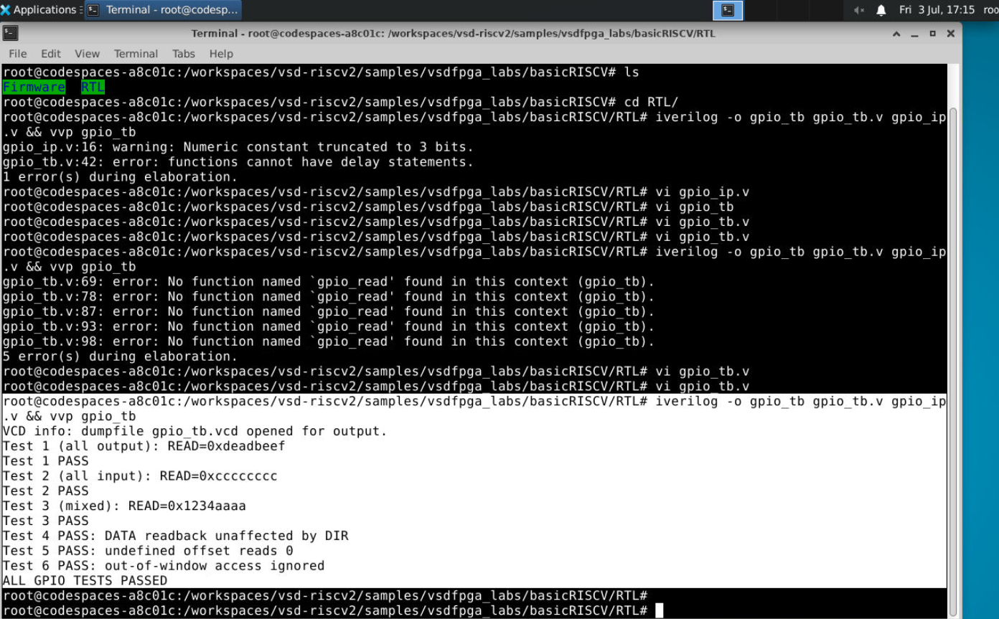

---

## 8. Standalone Simulation — PWM

```verilog
`timescale 1ns/1ps
module pwm_tb;
    reg clk;
    reg resetn;
    reg isIO;
    reg mem_wstrb;
    reg [31:0] mem_addr;
    reg [31:0] mem_wdata;
    wire [31:0] pwm_rdata;
    wire        pwm_out;
    wire        pwm_sel;

    localparam PWM_BASE   = 32'h0040_1000;
    localparam OFF_CTRL   = 32'h00;
    localparam OFF_PERIOD = 32'h04;
    localparam OFF_DUTY   = 32'h08;
    localparam OFF_STATUS = 32'h0C;

    pwm_ip DUT (
        .clk(clk), .resetn(resetn), .isIO(isIO),
        .mem_wstrb(mem_wstrb), .mem_addr(mem_addr), .mem_wdata(mem_wdata),
        .pwm_rdata(pwm_rdata), .pwm_out(pwm_out), .pwm_sel(pwm_sel)
    );

    always #5 clk = ~clk;

    task pwm_write(input [31:0] off, input [31:0] data);
        begin
            @(posedge clk);
            mem_addr  = PWM_BASE + off;
            mem_wdata = data;
            mem_wstrb = 1;
            @(posedge clk);
            mem_wstrb = 0;
        end
    endtask

    integer errors = 0;
    integer high_count, low_count, i;

    initial begin
        $dumpfile("pwm_tb.vcd");
        $dumpvars(0, pwm_tb);

        clk = 0; resetn = 0; isIO = 1;
        mem_wstrb = 0; mem_addr = 0; mem_wdata = 0;
        #20 resetn = 1;

        // --- Test 1: PERIOD=10, DUTY=4, POL=0, EN=1 -> expect 4 high, 6 low per cycle ---
        pwm_write(OFF_PERIOD, 32'd10);
        pwm_write(OFF_DUTY,   32'd4);
        pwm_write(OFF_CTRL,   32'b01); // EN=1, POL=0

        high_count = 0; low_count = 0;
        for (i = 0; i < 10; i = i + 1) begin
            @(posedge clk);
            if (pwm_out) high_count = high_count + 1;
            else         low_count  = low_count + 1;
        end

        $display("Test 1 (PERIOD=10 DUTY=4 POL=0): high=%0d low=%0d", high_count, low_count);
        if (high_count == 4 && low_count == 6) $display("Test 1 PASS");
        else begin $display("Test 1 FAIL"); errors = errors + 1; end

        // --- Test 2: same PERIOD/DUTY, POL=1 (inverted) -> expect 4 low, 6 high ---
        pwm_write(OFF_CTRL, 32'b11); // EN=1, POL=1

        high_count = 0; low_count = 0;
        for (i = 0; i < 10; i = i + 1) begin
            @(posedge clk);
            if (pwm_out) high_count = high_count + 1;
            else         low_count  = low_count + 1;
        end

        $display("Test 2 (POL=1 inverted): high=%0d low=%0d", high_count, low_count);
        if (high_count == 6 && low_count == 4) $display("Test 2 PASS");
        else begin $display("Test 2 FAIL"); errors = errors + 1; end

        // --- Test 3: EN=0 forces inactive level (low, since POL=0 here) ---
        pwm_write(OFF_CTRL, 32'b00); // EN=0, POL=0
        @(posedge clk);
        if (pwm_out == 1'b0) $display("Test 3 PASS: EN=0 forces low");
        else begin $display("Test 3 FAIL: pwm_out=%b, expected 0", pwm_out); errors = errors + 1; end

        // --- Test 4: DUTY=0 -> always low while enabled ---
        pwm_write(OFF_DUTY, 32'd0);
        pwm_write(OFF_CTRL, 32'b01); // EN=1, POL=0
        high_count = 0;
        for (i = 0; i < 10; i = i + 1) begin
            @(posedge clk);
            if (pwm_out) high_count = high_count + 1;
        end
        if (high_count == 0) $display("Test 4 PASS: DUTY=0 always low");
        else begin $display("Test 4 FAIL: saw %0d high cycles", high_count); errors = errors + 1; end

        // --- Test 5: DUTY >= PERIOD -> always high ---
        pwm_write(OFF_DUTY, 32'd20); // > PERIOD(10)
        low_count = 0;
        for (i = 0; i < 10; i = i + 1) begin
            @(posedge clk);
            if (!pwm_out) low_count = low_count + 1;
        end
        if (low_count == 0) $display("Test 5 PASS: DUTY>=PERIOD always high");
        else begin $display("Test 5 FAIL: saw %0d low cycles", low_count); errors = errors + 1; end

        // --- Test 6: read-back sanity ---
        pwm_write(OFF_PERIOD, 32'd50);
        @(posedge clk);
        mem_addr = PWM_BASE + OFF_PERIOD;
        #1;
        if (pwm_rdata == 32'd50) $display("Test 6 PASS: PERIOD readback correct");
        else begin $display("Test 6 FAIL: got 0x%h", pwm_rdata); errors = errors + 1; end

        // --- Test 7: undefined offset returns 0 ---
        mem_addr = PWM_BASE + 32'h10; // beyond STATUS
        #1;
        if (pwm_rdata == 32'h0) $display("Test 7 PASS: undefined offset reads 0");
        else begin $display("Test 7 FAIL: got 0x%h", pwm_rdata); errors = errors + 1; end

        if (errors == 0) $display("ALL PWM TESTS PASSED");
        else              $display("%0d PWM TEST(S) FAILED", errors);

        $finish;
    end
endmodule
```

Result: `iverilog -o pwm_tb pwm_tb.v pwm_ip.v && vvp pwm_tb`

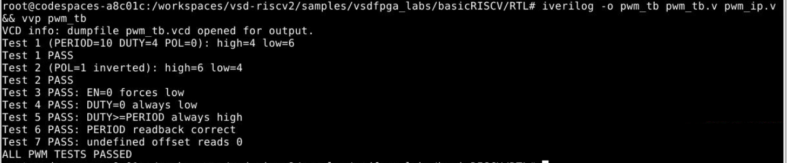

---

## 9. Firmware

### gpio_test.c

```c
#include "io.h"

void print_string(const char* s);
void print_hex(unsigned int val);

int main() {
    uint32_t val;
    int all_passed = 1;

    print_string("\n--- Starting GPIO Task-6 Validation (windowed decode) ---\n");

    // Test 1: all outputs
    print_string("\nTest 1: All Outputs (DIR = 0xFFFFFFFF)\n");
    IO_OUT(IO_GPIO_DIR, 0xFFFFFFFF);
    IO_OUT(IO_GPIO_DATA, 0xDEADBEEF);
    val = IO_IN(IO_GPIO_READ);
    print_string("Expected: DEADBEEF | Read: ");
    print_hex(val);
    print_string("\n");
    if (val == 0xDEADBEEF) {
        print_string("Test 1 PASS\n");
    } else {
        print_string("Test 1 FAIL\n");
        all_passed = 0;
    }

    // Test 2: all inputs
    print_string("\nTest 2: All Inputs (DIR = 0x00000000)\n");
    IO_OUT(IO_GPIO_DIR, 0x00000000);
    IO_OUT(IO_GPIO_DATA, 0xCAFEBABE);
    val = IO_IN(IO_GPIO_READ);
    print_string("Read (depends on gpio_in, tied to 0 unless bound to pins): ");
    print_hex(val);
    print_string("\n");
    if (val == 0x00000000) {
        print_string("Test 2 PASS\n");
    } else {
        print_string("Test 2 FAIL\n");
        all_passed = 0;
    }

    // Test 3: mixed mode
    print_string("\nTest 3: Mixed Mode (DIR = 0xFFFF0000)\n");
    IO_OUT(IO_GPIO_DIR, 0xFFFF0000);
    IO_OUT(IO_GPIO_DATA, 0x12345678);
    val = IO_IN(IO_GPIO_READ);
    print_string("Expected top half 1234, bottom depends on gpio_in | Read: ");
    print_hex(val);
    print_string("\n");
    if ((val & 0xFFFF0000) == 0x12340000) {
        print_string("Test 3 PASS\n");
    } else {
        print_string("Test 3 FAIL\n");
        all_passed = 0;
    }

    // Test 4: DATA readback is direction-independent
    print_string("\nTest 4: DATA register readback (independent of DIR)\n");
    val = IO_IN(IO_GPIO_DATA);
    print_string("Expected: 12345678 | Read: ");
    print_hex(val);
    print_string("\n");
    if (val == 0x12345678) {
        print_string("Test 4 PASS\n");
    } else {
        print_string("Test 4 FAIL\n");
        all_passed = 0;
    }

    if (all_passed) {
        print_string("\nALL TESTS PASSED! Task-6 GPIO IP (windowed) Validated.\n");
    } else {
        print_string("\nSOME TESTS FAILED! Check RTL.\n");
    }

    return 0;
}
```

### pwm_test.c

```c
#include "io.h"

void print_string(const char* s);
void print_hex(unsigned int val);

#define PWM_BASE 0x00401000
#define PWM_OUT(off, val) IO_OUT(PWM_BASE + (off), (val))
#define PWM_IN(off)       IO_IN(PWM_BASE + (off))

int main() {
    unsigned int val;
    int all_passed = 1;

    print_string("\n--- Starting PWM Task-6 Validation ---\n");

    // Test 1: PERIOD=1000, DUTY=250 (25% duty), POL=0, EN=1
    print_string("\nTest 1: Program PERIOD=1000 DUTY=250 EN=1\n");
    PWM_OUT(IO_PWM_PERIOD - PWM_BASE, 1000);
    PWM_OUT(IO_PWM_DUTY - PWM_BASE,   250);
    PWM_OUT(IO_PWM_CTRL - PWM_BASE,   0x1); // EN=1, POL=0

    val = PWM_IN(IO_PWM_PERIOD - PWM_BASE);
    print_string("PERIOD readback: ");
    print_hex(val);
    print_string("\n");
    if (val == 1000) {
        print_string("Test 1a PASS\n");
    } else {
        print_string("Test 1a FAIL\n");
        all_passed = 0;
    }

    val = PWM_IN(IO_PWM_DUTY - PWM_BASE);
    print_string("DUTY readback: ");
    print_hex(val);
    print_string("\n");
    if (val == 250) {
        print_string("Test 1b PASS\n");
    } else {
        print_string("Test 1b FAIL\n");
        all_passed = 0;
    }

    // Test 2: STATUS reflects EN
    print_string("\nTest 2: STATUS.RUNNING reflects EN\n");
    val = PWM_IN(IO_PWM_STATUS - PWM_BASE);
    print_string("STATUS: ");
    print_hex(val);
    print_string("\n");
    if (val & 0x1) {
        print_string("Test 2 PASS\n");
    } else {
        print_string("Test 2 FAIL\n");
        all_passed = 0;
    }

    // Test 3: Disable, check STATUS.RUNNING drops
    print_string("\nTest 3: Disable PWM (EN=0)\n");
    PWM_OUT(IO_PWM_CTRL - PWM_BASE, 0x0);
    val = PWM_IN(IO_PWM_STATUS - PWM_BASE);
    print_string("STATUS after disable: ");
    print_hex(val);
    print_string("\n");
    if ((val & 0x1) == 0) {
        print_string("Test 3 PASS\n");
    } else {
        print_string("Test 3 FAIL\n");
        all_passed = 0;
    }

    // Test 4: Board demo hook — sweep DUTY for visible brightness change.
    print_string("\nTest 4: DUTY sweep (board demo)\n");
    PWM_OUT(IO_PWM_CTRL - PWM_BASE, 0x1); // re-enable
    {
        int d;
        for (d = 0; d <= 1000; d += 100) {
            PWM_OUT(IO_PWM_DUTY - PWM_BASE, d);
        }
    }
    print_string("DUTY sweep complete (visually check LED on hardware)\n");

    if (all_passed) {
        print_string("\nALL TESTS PASSED! Task-6 PWM IP Validated.\n");
    } else {
        print_string("\nSOME TESTS FAILED! Check RTL.\n");
    }

    return 0;
}
```

Both binaries are built with the generic pattern rule already present in the firmware `Makefile` (`%.bram.elf: %.o ...`, `%.hex: %.elf ...`), so no per-file Makefile targets were needed — `make gpio_test.bram.hex` and `make pwm_test.bram.hex` both worked directly against the existing rules.

---

## 10. Full SoC Integration into riscv.v

Both `gpio_ip.v` and `pwm_ip.v` are `` `include``d at the top of `riscv.v` and instantiated on the shared memory bus:

```verilog
wire [31:0] gpio_out;
wire [31:0] gpio_rdata;
wire        gpio_sel;
wire [31:0] gpio_in = 32'h0;   // tied off until physical pins are mapped

gpio_ip GPIO(
    .clk(clk),
    .resetn(resetn),
    .isIO(isIO),
    .mem_wstrb(mem_wstrb),
    .mem_addr(mem_addr),
    .mem_wdata(mem_wdata),
    .gpio_in(gpio_in),
    .gpio_rdata(gpio_rdata),
    .gpio_out(gpio_out),
    .gpio_sel(gpio_sel)
);

wire [31:0] pwm_rdata;
wire        pwm_out_sig;
wire        pwm_sel;

pwm_ip PWM(
    .clk(clk),
    .resetn(resetn),
    .isIO(isIO),
    .mem_wstrb(mem_wstrb),
    .mem_addr(mem_addr),
    .mem_wdata(mem_wdata),
    .pwm_rdata(pwm_rdata),
    .pwm_out(pwm_out_sig),
    .pwm_sel(pwm_sel)
);
```

The `IO_rdata` mux selects between LEDS/UART, GPIO, and PWM based on `gpio_sel`/`pwm_sel`:

```verilog
wire [31:0] IO_rdata = (mem_wordaddr[IO_UART_CNTL_bit] & !gpio_sel & !pwm_sel) ? {22'b0, !uart_ready, 9'b0}
                     : gpio_sel ? gpio_rdata
                     : pwm_sel  ? pwm_rdata
                     : 32'b0;
```

`gpio_in` is currently tied to `32'h0` — no physical pin has been mapped to it yet, so GPIO's input mode is only meaningfully testable in simulation (where `gpio_in` can be driven directly by the testbench) until hardware bring-up wires it to a real pin.

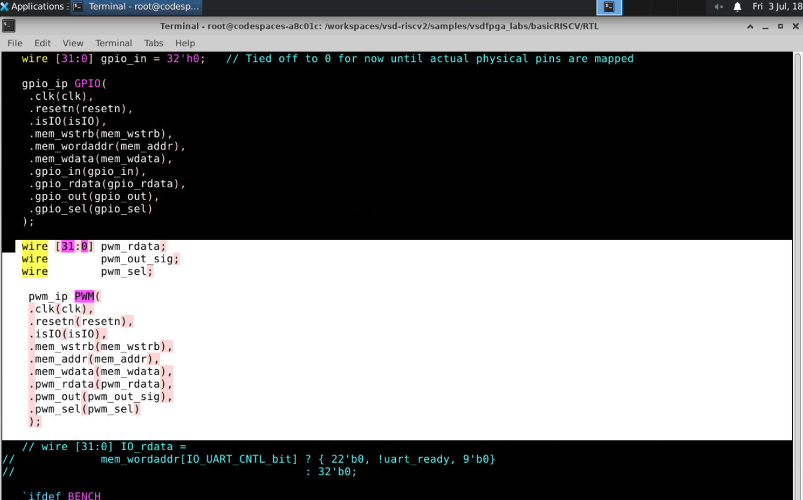
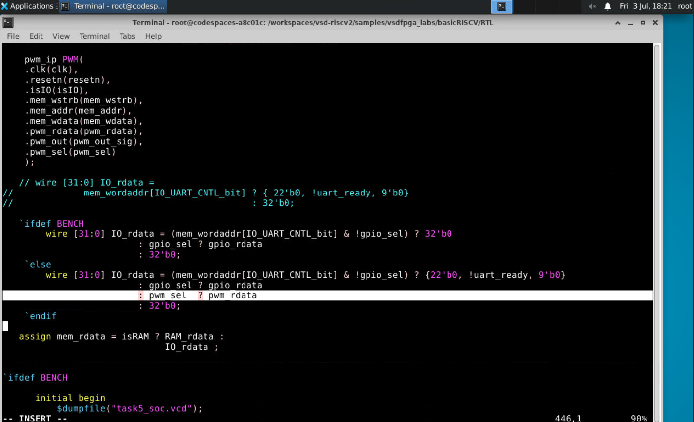

---

## 11. Full-SoC Simulation — Individual Firmware

With the CPU actually executing compiled firmware (rather than a testbench directly driving `mem_addr`/`mem_wdata`), each IP was validated end-to-end through the real bus.

Build and load `gpio_test.bram.hex`:

Result: `make gpio_test.bram.hex`

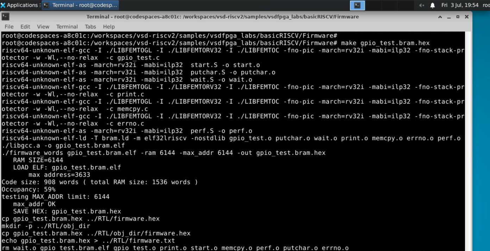

Full-SoC simulation with GPIO firmware loaded:

Result: `iverilog -DBENCH -o soc_sim riscv.v pwm_ip.v soc_tb.v && vvp soc_sim`

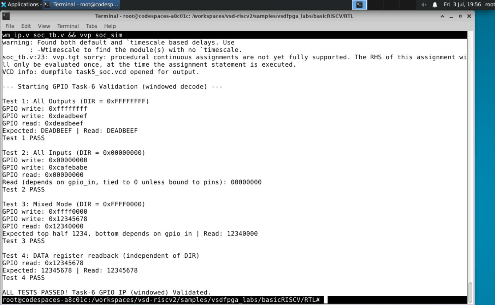

Build and load `pwm_test.bram.hex`:

Result: `make pwm_test.bram.hex`

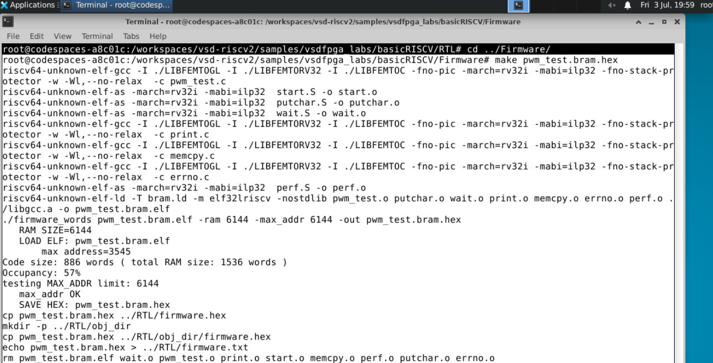

---

## 12. Bug Found During Full-SoC PWM Validation, and the Fix

The first full-SoC run with PWM firmware loaded produced all-zero reads for every PWM register — `PERIOD readback: 00000000`, `DUTY readback: 00000000`, `STATUS: 00000000` — despite the writes themselves appearing to succeed.

Result: Wrong Output

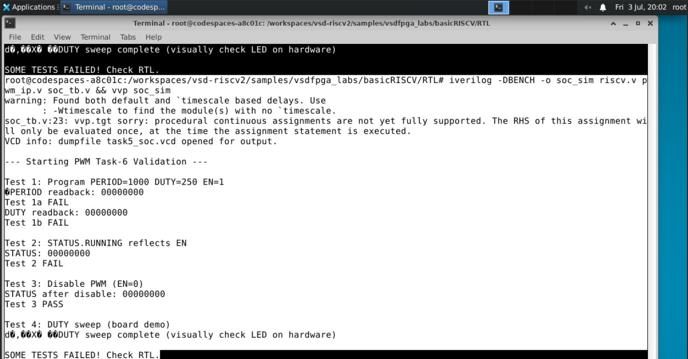

Root cause: `riscv.v` had **two** definitions of `IO_rdata`, guarded by `` `ifdef BENCH `` / `` `else``. The `` `else`` branch (intended for real hardware) had been correctly updated with the `pwm_sel ? pwm_rdata` term, but the `` `ifdef BENCH`` branch — the one actually active during simulation, since builds use `-DBENCH` — still only handled `gpio_sel` and fell through to `32'b0` for everything else:

```verilog
// before — BENCH branch missing the PWM term
`ifdef BENCH
    wire [31:0] IO_rdata = (mem_wordaddr[IO_UART_CNTL_bit] & !gpio_sel) ? 32'b0
                         : gpio_sel ? gpio_rdata
                         : 32'b0;
`else
    wire [31:0] IO_rdata = (mem_wordaddr[IO_UART_CNTL_bit] & !gpio_sel & !pwm_sel) ? {22'b0, !uart_ready, 9'b0}
                         : gpio_sel ? gpio_rdata
                         : pwm_sel  ? pwm_rdata
                         : 32'b0;
`endif
```

So every PWM *write* was landing correctly (writes don't go through `IO_rdata` at all), but every PWM *read* fell through to the default `32'b0` in simulation specifically — consistent with the observed symptom of readback-only failure.

Fix: mirror the `` `else`` branch's `pwm_sel` handling into the `` `ifdef BENCH`` branch:

```verilog
// after
`ifdef BENCH
    wire [31:0] IO_rdata = (mem_wordaddr[IO_UART_CNTL_bit] & !gpio_sel & !pwm_sel) ? 32'b0
                         : gpio_sel ? gpio_rdata
                         : pwm_sel  ? pwm_rdata
                         : 32'b0;
`else
    ...
```

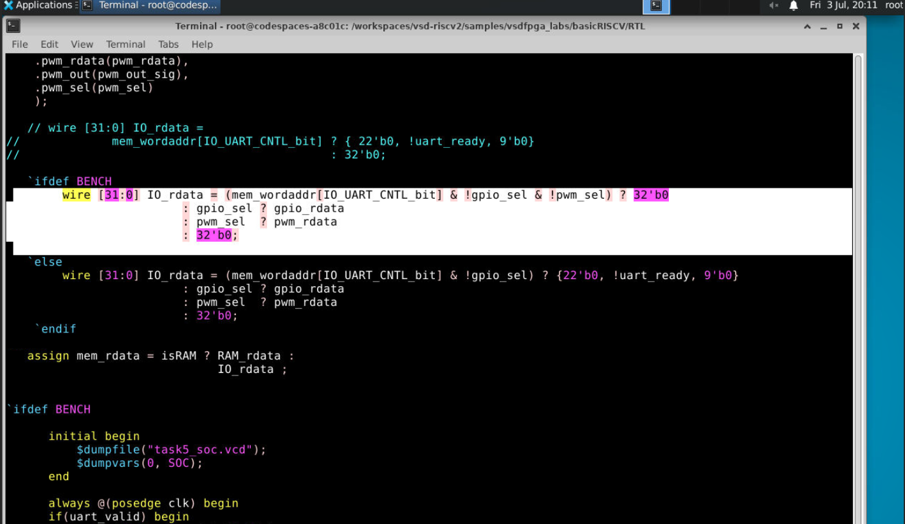

Result: `iverilog -DBENCH -o soc_sim riscv.v pwm_ip.v soc_tb.v && vvp soc_sim`

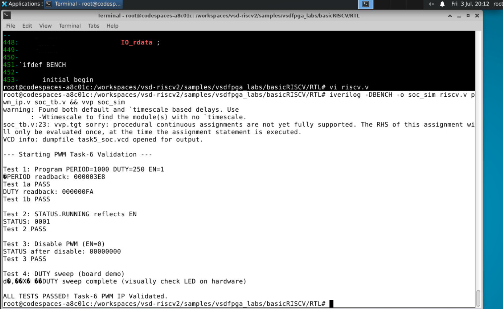

---

## 13. Combined Firmware Validation

With both IPs individually proven correct through the full SoC, the last simulation step is proving they coexist in a single boot — specifically checking that writes/reads to one IP don't disturb the other (register aliasing, `_sel` signals overlapping, etc.).

```c
#include "io.h"

void print_string(const char* s);
void print_hex(unsigned int val);

int main() {
    unsigned int val;
    int all_passed = 1;

    print_string("\n--- Starting Combined GPIO+PWM Task-6 Validation ---\n");

    // --- GPIO: mixed-mode test ---
    print_string("\n[GPIO] Mixed Mode (DIR = 0xFFFF0000)\n");
    IO_OUT(IO_GPIO_DIR, 0xFFFF0000);
    IO_OUT(IO_GPIO_DATA, 0x12345678);
    val = IO_IN(IO_GPIO_READ);
    print_string("Read: ");
    print_hex(val);
    print_string("\n");
    if ((val & 0xFFFF0000) == 0x12340000) {
        print_string("[GPIO] PASS\n");
    } else {
        print_string("[GPIO] FAIL\n");
        all_passed = 0;
    }

    // --- PWM: program PERIOD/DUTY, right after GPIO access ---
    print_string("\n[PWM] Program PERIOD=1000 DUTY=250 EN=1\n");
    IO_OUT(IO_PWM_PERIOD, 1000);
    IO_OUT(IO_PWM_DUTY,   250);
    IO_OUT(IO_PWM_CTRL,   0x1);

    val = IO_IN(IO_PWM_PERIOD);
    print_string("PERIOD readback: ");
    print_hex(val);
    print_string("\n");
    if (val == 1000) {
        print_string("[PWM] PERIOD PASS\n");
    } else {
        print_string("[PWM] PERIOD FAIL\n");
        all_passed = 0;
    }

    // --- Interleave: re-check GPIO after PWM writes, to catch cross-talk ---
    print_string("\n[GPIO] Re-check DATA after PWM writes\n");
    val = IO_IN(IO_GPIO_DATA);
    print_string("Read: ");
    print_hex(val);
    print_string("\n");
    if (val == 0x12345678) {
        print_string("[GPIO] Re-check PASS (no cross-talk from PWM)\n");
    } else {
        print_string("[GPIO] Re-check FAIL (possible IP cross-talk!)\n");
        all_passed = 0;
    }

    // --- Interleave: re-check PWM after GPIO access, to catch cross-talk ---
    print_string("\n[PWM] Re-check DUTY after GPIO access\n");
    val = IO_IN(IO_PWM_DUTY);
    print_string("Read: ");
    print_hex(val);
    print_string("\n");
    if (val == 250) {
        print_string("[PWM] Re-check PASS (no cross-talk from GPIO)\n");
    } else {
        print_string("[PWM] Re-check FAIL (possible IP cross-talk!)\n");
        all_passed = 0;
    }

    if (all_passed) {
        print_string("\nALL COMBINED TESTS PASSED! GPIO + PWM coexist correctly.\n");
    } else {
        print_string("\nSOME COMBINED TESTS FAILED! Check RTL.\n");
    }

    return 0;
}
```

The interleaving (GPIO write → PWM write → re-check GPIO → re-check PWM) is deliberate: it's specifically structured to surface a cross-talk bug, not just re-prove each IP works in isolation again.

Result: `make combined_test.bram.hex`

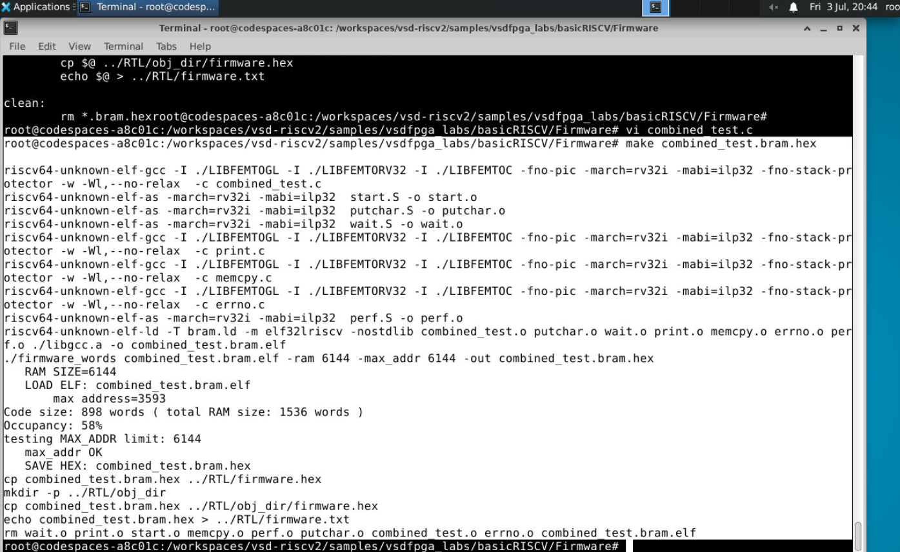

Result: `iverilog -DBENCH -o soc_sim riscv.v pwm_ip.v soc_tb.v && vvp soc_sim`

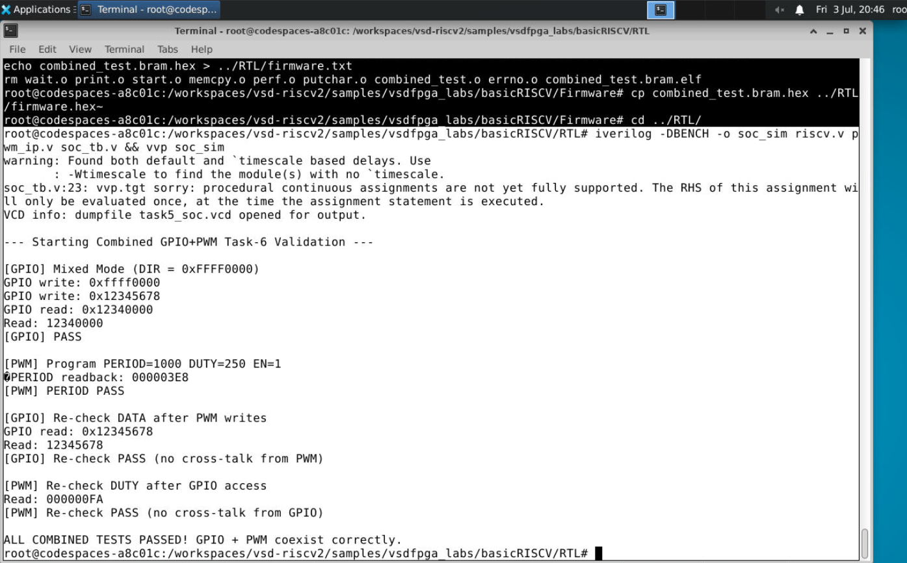


---

## 14. Synthesis

With both IPs `` `include``d into `riscv.v` and simulation fully validated, the design was taken through synthesis, place-and-route, and static timing analysis targeting the iCE40 UP5K on the VSDSquadron FM board.

The `Makefile`'s `build` target invokes `synth_ice40` with `-abc9`, which this yosys build doesn't support in combination with `synth_ice40` (`ERROR: Command syntax error`). As in Task 4, the fix is to run the same stages manually without that flag:

```bash
yosys -q -p "synth_ice40 -device u -dsp -top SOC -json SOC.json" riscv.v
nextpnr-ice40 --force --json SOC.json --pcf VSDSquadronFM.pcf --asc SOC.asc --freq 10 --up5k --package sg48 --opt-timing
icetime -p VSDSquadronFM.pcf -P sg48 -r SOC.timings -d up5k -t SOC.asc
icepack -s SOC.asc SOC.bin
```

### Synthesis and packing

`yosys` maps `riscv.v` (CPU core, LEDS/UART, and now `gpio_ip`/`pwm_ip`) onto iCE40 primitives, and `nextpnr-ice40` constrains the top-level ports to the board's actual pins per `VSDSquadronFM.pcf`:

```
Info: constrained 'LEDS[0]' to bel 'X4/Y31/io0'
Info: constrained 'LEDS[1]' to bel 'X6/Y31/io0'
Info: constrained 'LEDS[2]' to bel 'X5/Y31/io0'
Info: constrained 'LEDS[3]' to bel 'X19/Y31/io1'
Info: constrained 'LEDS[4]' to bel 'X18/Y31/io0'
Info: constrained 'RESET' to bel 'X19/Y31/io0'
Info: constrained 'CLK' to bel 'X17/Y31/io0'
Info: constrained 'TXD' to bel 'X9/Y0/io0'
Info: constrained 'RXD' to bel 'X9/Y0/io1'
```

Device utilization on the UP5K, with both new IPs included:

```
ICESTORM_LC:  1213/5280   23%
ICESTORM_RAM:   16/30     53%
SB_IO:           9/96      9%
SB_GB:           6/8      75%
ICESTORM_PLL:    0/1       0%
ICESTORM_HFOSC:  1/1     100%
```

Comfortably within budget — no LC, RAM, or IO pressure from adding GPIO and PWM.

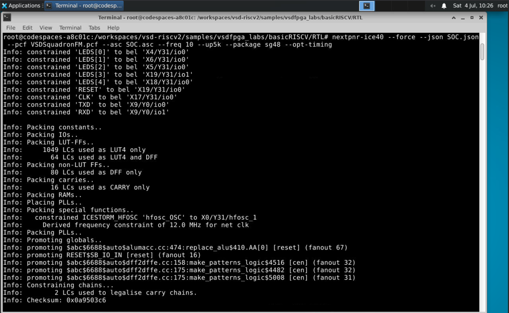

### Timing closure

`nextpnr-ice40` reports the achievable clock frequency after placement and routing:

```
Info: Max frequency for clock 'clk': 15.51 MHz (PASS at 12.00 MHz)

Info: Max delay <async>     -> posedge clk: 4.07 ns
Info: Max delay posedge clk -> <async>    : 17.83 ns
```

15.51 MHz clears the 12 MHz requirement with margin, though it's tighter than Task 4's GPIO-only build (17.75 MHz) — consistent with the extra decode and counter logic PWM adds to the bus. `icetime`'s independent static timing analysis corroborates this:

```
Warning: timing analysis not supported for cell type HFOSC
// Timing estimate: 62.88 ns (15.90 MHz)
```

(The HFOSC warning is expected — `icetime` doesn't model the internal oscillator primitive's timing, so it estimates the rest of the logic around it; nextpnr's own report already accounts for the derived 12 MHz HFOSC constraint.)

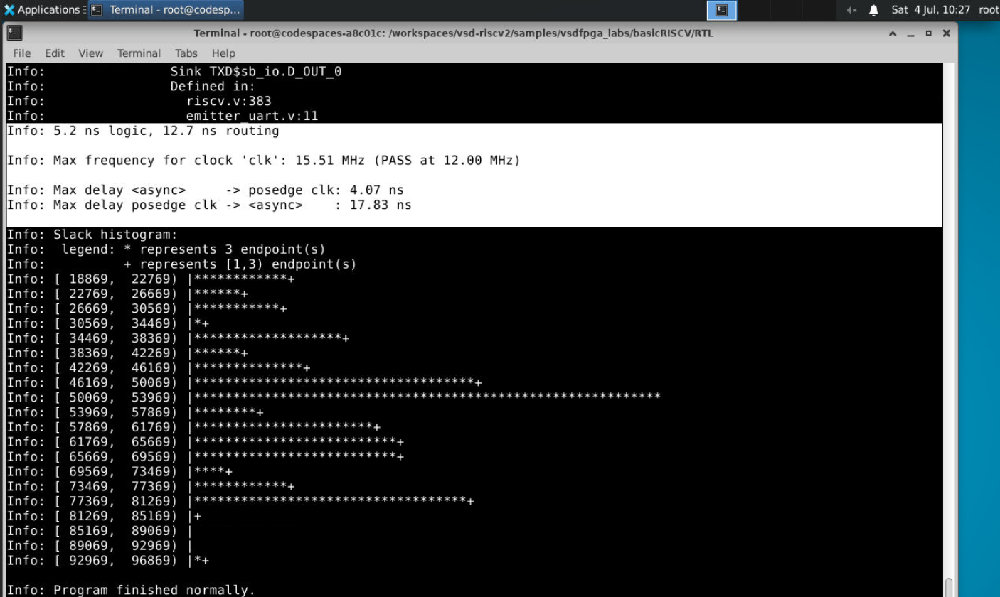

### Bitstream generation

```bash
root@codespaces-a8c01c:...RTL# icetime -p VSDSquadronFM.pcf -P sg48 -r SOC.timings -d up5k -t SOC.asc
// Timing estimate: 62.88 ns (15.90 MHz)
root@codespaces-a8c01c:...RTL# icepack -s SOC.asc SOC.bin
root@codespaces-a8c01c:...RTL# ls -la SOC.bin
-rw-rw-rw- 1 root root 104090 Jul  4 10:28 SOC.bin
```

`SOC.bin` (104,090 bytes) is the final bitstream, ready to flash.

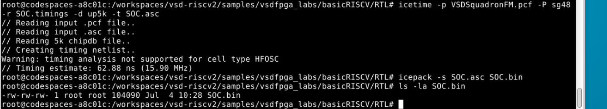

## 15. Hardware

With the bitstream (SOC.bin) successfully generated and timing constraints met, the final step is to flash the design onto the VSDSquadron FM board.

We can automate the cleanup, build, and programming processes using the included Makefile. Ensure the board is connected via USB and configured correctly before proceeding.

Run the following commands in your terminal:

Run the following commands in your terminal:

Bash
# Clean up any old build artifacts, binaries, and logs
make clean

# Re-build the firmware and synthesize the bitstream 
make build

# Flash the generated bitstream (SOC.bin) to the iCE40 board
sudo make flash

Expected Hardware Behavior:
Once flashed, the processor will boot and load the compiled firmware (combined_test.c).

The GPIO tests will execute invisibly in the background, validating the data direction and readback logic.

The PWM duty cycle sweep will be physically observable. If the PWM output is routed to an onboard LED, you will see it "breathe" (gradually increase and decrease in brightness) as the DUTY register is stepped from 0 to 1000. If routed to an external pin, this sweep can be verified using a logic analyzer or oscilloscope.

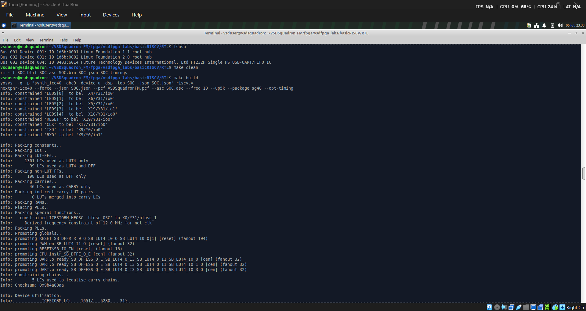
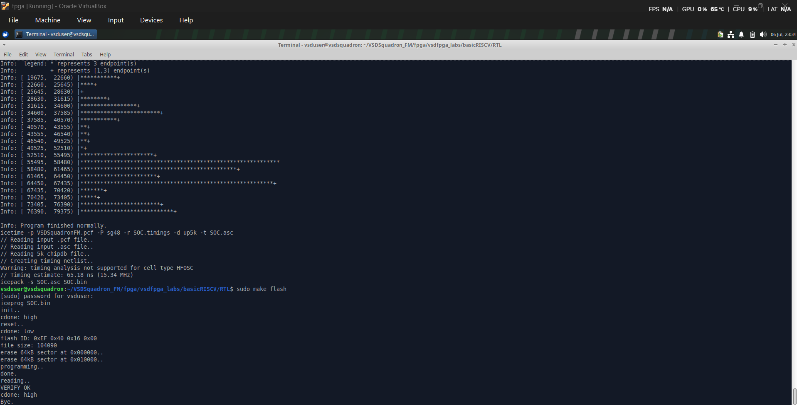
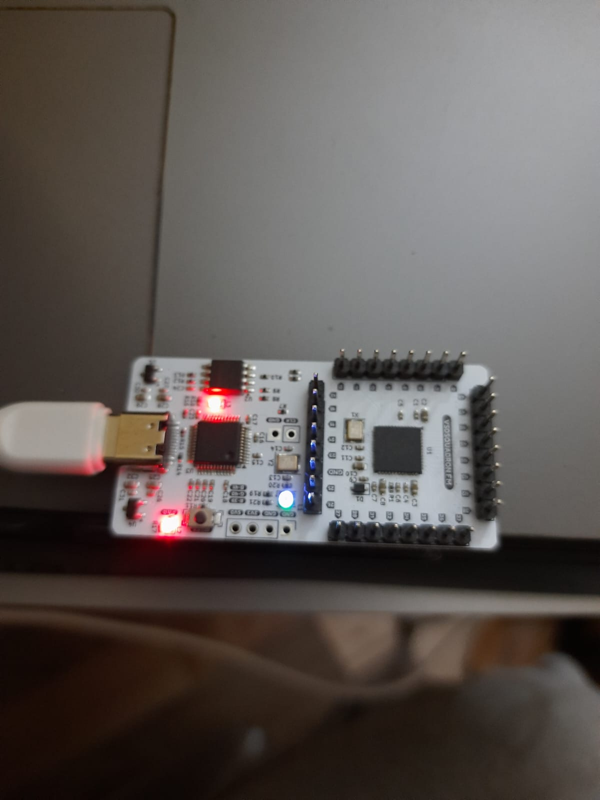
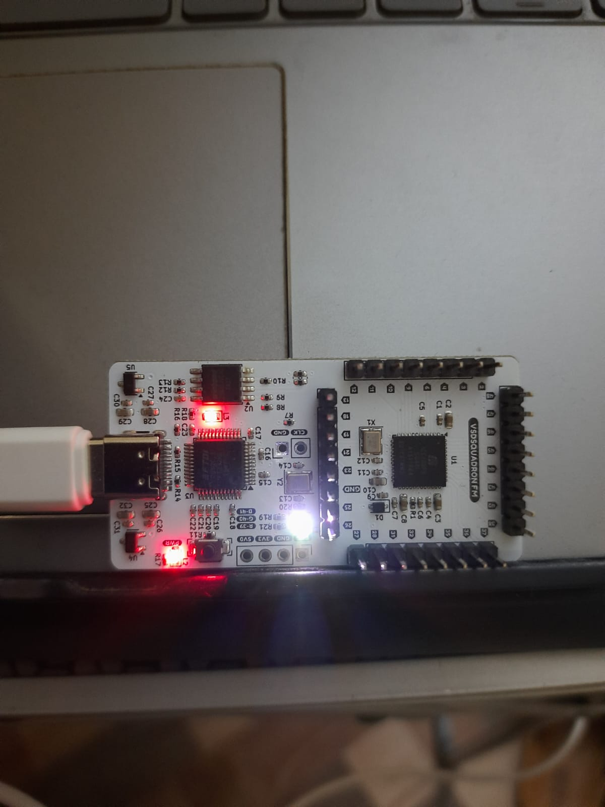

## 16. Conclusion

Task 6 successfully demonstrates the transition from legacy, tightly coupled peripheral logic to a modular and scalable IP integration strategy. By implementing a 4KB-aligned windowed address decoding scheme, the RISC-V SoC can now seamlessly support multiple independent memory-mapped peripherals without address aliasing or bus conflicts.

Key Achievements:

IP Development: Designed and validated two independent hardware blocks: a 3-register GPIO IP (supporting dynamic input/output switching) and a 4-register PWM IP (supporting programmable duty cycle, period, and polarity).

Robust Verification: Validated the designs at multiple levels of abstraction—from standalone RTL testbenches to full-SoC simulations running compiled C firmware.

Integration Debugging: Successfully identified and patched a simulation-specific bus routing bug (ifdef BENCH) that masked the PWM readback capability, ensuring parity between simulation and physical hardware behavior.

Hardware Realization: Successfully synthesized the updated SoC, cleanly meeting the 12 MHz timing requirements (achieving 15.51 MHz) with minimal resource overhead, and generated the final bitstream for the iCE40 UP5K board.

With the GPIO and PWM IPs fully integrated, validated, and flashed, the foundation is laid for developing and integrating even more complex communication and control peripherals in future tasks.

